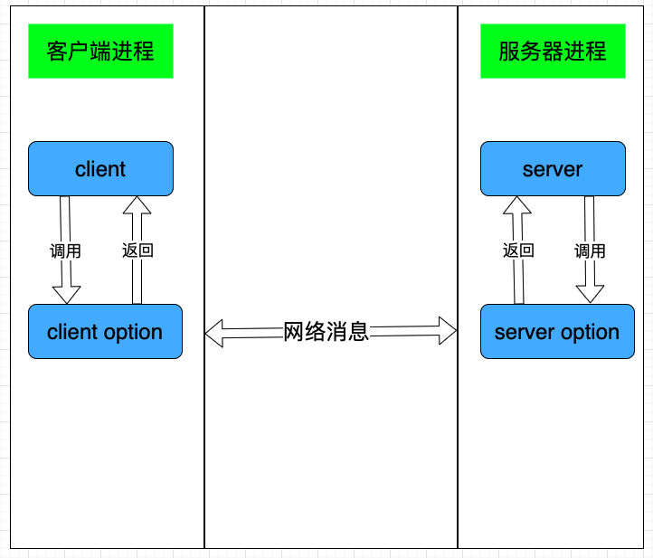
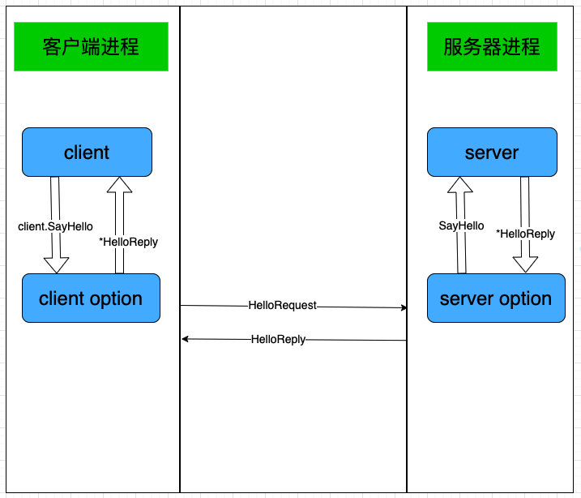
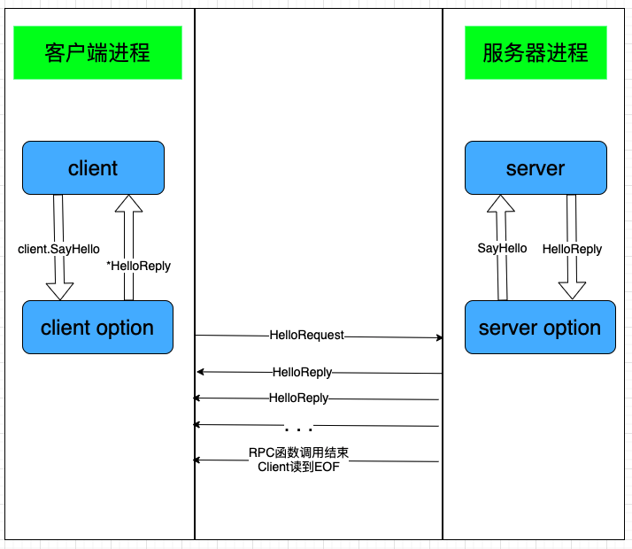
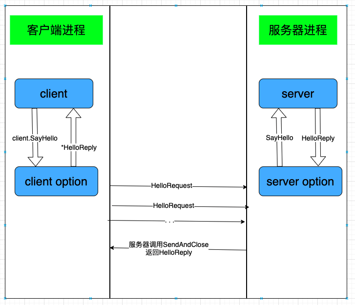
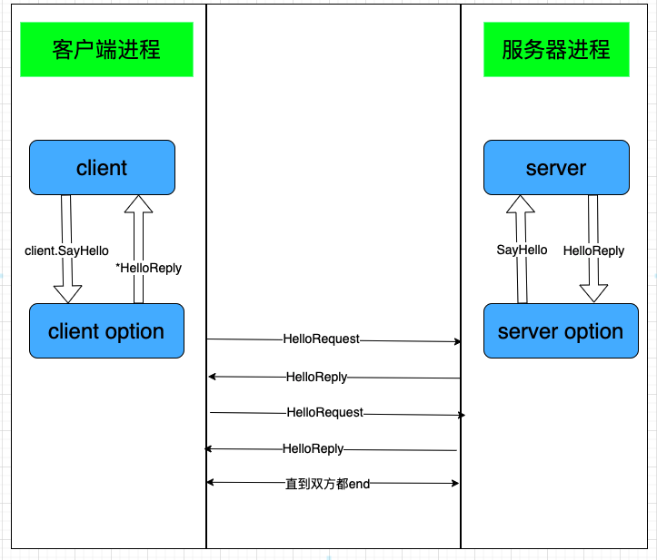

本文是公众号读者滴滴滴的原创投稿。在本文中，滴滴滴首先讲解了什么是RPC，什么是gRPC，之后以恋爱中的小情侣模拟客户端与服务器，生动有趣地讲解了RPC的不同调用方式，最后通过代码Demo实现小情侣之间的gRPC交互日常。

小菜刀在这里，感谢滴滴滴的投稿。如果其他读者朋友们也想分享一些在Go学习中的心得笔记，欢迎来稿！

## RPC

对RPC不了解的人，或许会纠结其与TCP、HTTP等的关系。后者是网络传输中的协议，而RPC是一种设计、实现框架，通讯协议只是其中一部分，RPC不仅要解决协议通讯的问题，还有序列化与反序列化，以及消息通知。

一个完整的RPC架构里面包含了四个核心的组件，分别是Client ,Server,ClientOptions以及ServerOptions，这个Options就是RPC需要设计实现的东西。

- 客户端（Client）：服务的调用方。

- 服务端（Server）：真正的服务提供方。

- 客户端存根（ClientOption）：socket管理，网络收发包的序列化。

- 服务端存根（ServerOption）：socket管理，提醒server层rpc方法调用，以及网络收发包的序列化。

RPC的逻辑示意图如下




## 什么是gRPC

gRPC是RPC的一种，它使用Protocol Buffer(简称Protobuf)作为序列化格式，Protocol Buffer是来自google的序列化框架，比Json更加轻便高效，同时基于 HTTP/2 标准设计，**带来诸如双向流、流控、头部压缩、单 TCP 连接上的多复用请求**等特性。这些特性使得其在移动设备上表现更好，更省电和节省空间占用。用protoc就能使用proto文件帮助我们生成上面的option层代码。

在gRPC中，客户端应用程序可以直接在另一台计算机上的服务器应用程序上调用方法，就好像它是本地对象一样，从而使您更轻松地创建分布式应用程序和服务。

gRPC的调用模型如下


## 适用场景

- **分布式场景** ：gRPC设计为低延迟和高吞吐量通信，非常适用于效率至关重要的轻型微服务。
- **点对点实时通信**： gRPC对双向流媒体提供出色的支持，可以实时推送消息而无需轮询。
- **多语言混合开发** ：支持主流的开发语言，使gRPC成为多语言开发环境的理想选择。
- **网络受限环境** ： 使用Protobuf（一种轻量级消息格式）序列化gRPC消息。gRPC消息始终小于等效的JSON消息。

## 四种调用方式

学习gRPC使用之前，先介绍一下RPC中的客户端与服务端。在RPC中，服务端会开启服务供客户端调用，每一句RPC调用都是一次客户端发请求到服务器获得相应的过程，中间过程被封装了，看起来像本地的一次调用一样，一次RPC调用也就是一次通讯过程。

RPC调用通常根据双端是否流式交互，分为了单项RPC、服务端流式RPC、客户端流式RPC、双向流PRC四种方式。为了便于大家理解四种grpc调用的应用场景，这里举一个例子，假设你是小超，有一个女朋友叫婷婷，婷婷的每种情绪代表一个微服务，你们之间的每一次对话可以理解为一次PRC调用，为了便于画流程图，RPC请求被封装成client.SayHello，请求包为HelloRequest，响应为HelloReply。

##### 	1. 单项 RPC

当你在等婷婷回去吃饭，婷婷在加班时，你们之间的rpc调用可能是这样的：

*小超：回来吃饭吗*

*婷婷：还在加班*

这就是单项 RPC，即客户端发送一个请求给服务端，从服务端获取一个应答，就像一次普通的函数调用。



* client层调用SayHello接口，把HelloRequest包进行序列化
* client option将序列化的数据发送到server端
* server option接收到rpc请求
* 将rpc请求返回给server端，server端进行处理，将结果给server option
* server option将HelloReply进行序列化并发给client
* client option做反序列化处理，并返回给client层

##### 2. 服务端流式 RPC

当你比赛输了给婷婷发消息时：

*小超：今天比赛输了*

*婷婷：没事，一次比赛而已*

*婷婷：晚上带你去吃好吃的*

这就是服务端流式 RPC，即客户端发送一个请求给服务端，可获取一个数据流用来读取一系列消息。客户端从返回的数据流里一直读取直到没有更多消息为止。



* client层调用SayHello接口，把HelloRequest包进行序列化
* client option将序列化的数据发送到server端
* server option接收到rpc请求
* 将rpc请求返回给server端，server端进行处理，将将数据流给server option
* server option将HelloReply进行序列化并发给client
* client option做反序列化处理，并返回给client层

##### 3. 客户端流式 RPC

当你惹婷婷生气的时候：

*小超：怎么了，宝贝*

*小超：别生气了，带你吃好吃的*

*婷婷：滚*

客户端流式 RPC，即客户端用提供的一个数据流写入并发送一系列消息给服务端。一旦客户端完成消息写入，就等待服务端读取这些消息并返回应答，



* client层调用SayHello接口，把HelloRequest包进行序列化
* client option将序列化的数据流发送到server端
* server option接收到rpc请求
* 将rpc请求返回给server端，server端进行处理，将结果给server option
* server option将HelloReply进行序列化并发给client
* client option做反序列化处理，并返回给client层

##### 4. 双向流 RPC

当你哄好婷婷时：

*小超：今天看了一个超好看的视频*

*婷婷：什么视频*

*小超：发给你看看*

*婷婷：这也叫好看？*

双向流 RPC，即两边都可以分别通过一个读写数据流来发送一系列消息。这两个数据流操作是相互独立的，所以客户端和服务端能按其希望的任意顺序读写，例如：服务端可以在写应答前等待所有的客户端消息，或者它可以先读一个消息再写一个消息，或者是读写相结合的其他方式。每个数据流里消息的顺序会被保持



这幅图就不做流程介绍了，读者可以自己试着看图能不能理解过程，相信理解了客户端流RPC和服务端流RPC俩种方式，这里一定可以理解的。

## gPRC代码实现

gRPC 使用 Protobuf 作为序列化格式，Protobuf 比 Json 更加轻便高效。与Json一样，它与开发语言和平台无关，具有良好的可扩展性。关于Protobuf 使用请参考官网地址 https://developers.google.com/protocol-buffers 。

下面我们实现Go语言版的四种gRPC调用方式。

##### 1. 单向RPC实现

###### 编写proto

```protobuf
//proto3标准
syntax = "proto3";

//包名
package helloworld;

//定义rpc接口
service Greets {
  rpc SayHello (HelloRequest) returns (HelloReply) {}
}

//HelloReply协议内容
message HelloReply {
  string name = 1;
  string message = 2;
}

//HelloRequest协议
message HelloRequest {
  string name = 1;
  string message = 2;
}
```

1. Greet为定义rpc服务的类名，rpc SayHello (HelloRequest) returns (HelloReply) {}表示定义rpc方法SayHello，传入HelloRequest，返回HelloReply
2. 进入proto文件夹，运行命令protoc -I . --go_out=plugins=grpc:. ./helloworld.proto在.目录中生成helloworld.pb.go文件

###### 编写server

```go
type Server struct {
}

//实现SayHello接口
func (s *Server) SayHello(ctx context.Context, in *pb.HelloRequest) (*pb.HelloReply, error) {
	log.Println(in.Name, in.Message)
	return &pb.HelloReply{Name: "婷婷", Message: "不回来了"}, nil
}

func main() {
	//协议类型以及ip，port
	lis, err := net.Listen("tcp", ":8002")
	if err != nil {
		fmt.Println(err)
		return
	}

	//定义一个rpc的server
	server := grpc.NewServer()
	//注册服务，相当与注册SayHello接口
	pb.RegisterGreetsServer(server, &Server{})
	//进行映射绑定
	reflection.Register(server)

	//启动服务
	err = server.Serve(lis)
	if err != nil {
		fmt.Println(err)
		return
	}
}
```

1. pb为proto文件生成的文件别名

2. 定义server结构体作为rpc调用的结构体，这个结构体必须实现SayHello这个接口

3. listen -> grpc.NewServer() -> pb.RegisterGreetsServer(server, &Server{}) -> s.Serve(lis) 


###### 编写client

```go
func main() {
	//创建一个grpc连接
	conn, err := grpc.Dial("localhost:8002", grpc.WithInsecure())
	if err != nil {
		fmt.Println(err)
		return
	}
	defer conn.Close()

	//创建RPC客户端
	client := pb.NewGreetsClient(conn)
	//设置超时时间
	_, cancel := context.WithTimeout(context.Background(), time.Second)
	defer cancel()

	// 调用方法
	reply, err := client.SayHello(context.Background(), &pb.HelloRequest{Name: "小超", Message: "回来吃饭吗"})
	if err != nil {
		log.Fatalf("couldn not greet: %v", err)
	}
	log.Println(reply.Name, reply.Message)
}
```

1. grpc.Dial("localhost:8002", grpc.WithInsecure())连接到服务器，grpc.WithInsecure()取消明文检测
2. context.WithTimeout(context.Background(), time.Second)设置超时时间
3. c := pb.NewGreetsClient(conn)创建rpc调用的客户端
4. c.SayHello(context.Background(), &pb.HelloRequest{Name: name})进行rpc调用

###### 抽象接口

其实也就是要实现这个接口，因为俩边都是单项调用，所以调用和实现的接口都是这个

```go
type GreetsClient interface {
   SayHello(ctx context.Context, in *HelloRequest, opts ...grpc.CallOption) (*HelloReply, error)
}
```

##### 2. 服务端流RPC

###### 编写proto

```protobuf
//proto3标准
syntax = "proto3";

//包名
package helloworld;

//定义rpc接口

service Greet{
  rpc SayHello (HelloRequest) returns(stream HelloReply) {}
}

//HelloReply协议内容
message HelloReply {
  string name = 1;
  string message = 2;
}

//HelloRequest协议
message HelloRequest {
  string name = 1;
  string message = 2;
}
```

相比于单项RPC调用，因为是客户端流，所以在HelloRequest多了一个stream

###### 编写server

```go
type Server struct {
}

//实现rpc接口
func (*Server) SayHello(request *pb.HelloRequest, server pb.Greet_SayHelloServer) error {
	fmt.Println(request)
	var err error
	for i := 0; i < 2; i++ {
		if i == 0 {
			err = server.Send(&pb.HelloReply{Name: "小超", Message: "没事，一次比赛而已"})
		} else {
			err = server.Send(&pb.HelloReply{Name: "小超", Message: "晚上带你去吃好吃的"})
		}
		if err != nil {
			fmt.Println(err)
			return err
		}
	}
	return nil
}

func main() {
	//协议类型以及ip，port
	listen, err := net.Listen("tcp", ":8002")
	if err != nil {
		fmt.Println(err)
		return
	}

	//定义一个rpc的server
	s := grpc.NewServer()
	//注册服务，相当与注册SayHello接口
	pb.RegisterGreetServer(s, &Server{})
	//进行映射绑定
	reflection.Register(s)

	//启动服务
	err = s.Serve(listen)
	if err != nil {
		fmt.Println(err)
	}
}
```

###### 编写client

client发送的是一个流，与单项RPC方式不同，他通过rpc调用获得的是一个流传输对象greetClient，可以用流传输对象不停的往对端发送数据

```go
func main() {
	//创建一个grpc的连接
	grpcConn, err := grpc.Dial("127.0.0.1"+":8002", grpc.WithInsecure())
	if err != nil {
		fmt.Println(err)
		return
	}

	//创建grpc的client
	client := pb.NewGreetClient(grpcConn)
	//设置超时时间
	ctx, cancel := context.WithTimeout(context.Background(), 10*time.Second)
	defer cancel()

	//调用rpc方法，获得流接口
	res, err := client.SayHello(ctx, &pb.HelloRequest{Name: "小超", Message: "今天比赛输了"})
	if err != nil {
		fmt.Println(err)
		return
	}

	//循环接收数据
	for {
		recv, err := res.Recv()
		if err != nil {
			fmt.Println(err)
			break
		}
		fmt.Println(recv)
	}
}
```

###### 抽象接口

服务器要实现的接口

```go
// GreetsServer is the server API for Greets service.
type GreetsServer interface {
   SayHello(Greets_SayHelloServer) error
}
```

客户端调用的接口

```go
type GreetsClient interface {
   SayHello(ctx context.Context, opts ...grpc.CallOption) (Greets_SayHelloClient, error)
}
```

##### 3. 服务端流RPC

###### 编写proto

```protobuf
//proto3标准
syntax = "proto3";

//包名
package helloworld;

//定义rpc接口
service Greets{
  rpc SayHello (stream HelloRequest) returns (HelloReply) {}
}

//HelloReply协议内容
message HelloReply {
  string name = 1;
  string message = 2;
}

//HelloRequest协议
message HelloRequest {
  string name = 1;
  string message = 2;
}
```

###### 编写服务器

```go
type Server struct{}

//实现rpc方法，直到对端调用CloseAndRecv就会读到EOF
func (*Server) SayHello(in pb.Greets_SayHelloServer) error {
	for {
		recv, err := in.Recv()
		//接收完数据之后发送响应
		if err == io.EOF {
			err := in.SendAndClose(&pb.HelloReply{Name: "婷婷", Message: "滚"})
			if err != nil {
				return err
			}
			return nil
		} else if err != nil {
			return err
		}
		fmt.Println(recv)
	}
}

func main() {
	//绑定协议，ip以及端口
	lis, err := net.Listen("tcp", ":8002")
	if err != nil {
		fmt.Println("failed to listen: %v", err)
		return
	}

	//创建一个grpc服务对象
	server := grpc.NewServer()
	//注册rpc服务
	pb.RegisterGreetsServer(server, &Server{})
	//注册服务端反射
	reflection.Register(server)

	//启动服务器
	err = server.Serve(lis)
	if err != nil {
		fmt.Println(err)
		return
	}
}
```

###### 编写客户端

```go
func main() {
	//创建一个grpc的连接
	grpcConn, err := grpc.Dial("127.0.0.1"+":8002", grpc.WithInsecure())
	if err != nil {
		fmt.Println(err)
		return
	}

	//创建grpc的client
	client := pb.NewGreetsClient(grpcConn)

	//设置超时时间
	ctx, cancel := context.WithTimeout(context.Background(), 10*time.Second)
	defer cancel()

	//调用rpc方法，得到一个客户端用于循环发送数据
	greetClient, err := client.SayHello(ctx)

	if err != nil {
		fmt.Println("sayHello error")
		fmt.Println(err)
		return
	}

	maxCount := 2
	curCount := 0

	//循环发送
	//调了CloseAndRecv()服务端就会读到EOF，server端可根据是否读到EOF来判断客户端是否将数据发完
	for {
		if curCount == 0 {
			err = greetClient.Send(&pb.HelloRequest{Name: "小超", Message: "怎么了，宝贝"})
		} else {
			err = greetClient.Send(&pb.HelloRequest{Name: "小超", Message: "别生气了，带你吃好吃的"})
		}

		if err != nil {
			fmt.Println("send error")
			fmt.Println(err)
			return
		}
		curCount += 1
		if curCount >= maxCount {
			res, err := greetClient.CloseAndRecv()
			if err != nil {
				fmt.Println(err)
				break
			}
			fmt.Println(res)
			break
		}
	}
}

```

###### 抽象接口

客户端接口

```protobuf
type GreetsClient interface {
   SayHello(ctx context.Context, opts ...grpc.CallOption) (Greets_SayHelloClient, error)
}
```

服务器接口

```protobuf
// GreetsServer is the server API for Greets service.
type GreetsServer interface {
   SayHello(Greets_SayHelloServer) error
}
```

### 双向流RPC

双向流RPC就交给读者自己练习吧，相信理解了单项RPC，客户端流RPC，服务端流RPC三种传输方式，写出双向流RPC应该没任何问题。

### 实现总结

其实弄懂了单项RPC、服务端流式RPC、客户端流式RPC、双向流PRC四种grpc应用场景，实现起来非常容易

1. 根据应用场景选择好哪种gRPC服务
2. 写好proto文件，用protoc生成.pb.go文件
3. 服务端实现接口->listen -> grpc.NewServer() -> pb.RegisterGreetsServer(server, &Server{}) -> s.Serve(lis)
4. 客户端grpc.Dial->pb.NewGreetsClient->context.WithTimeout->client.SayHello(调用接口)->如果是流传输则循环读取数据

