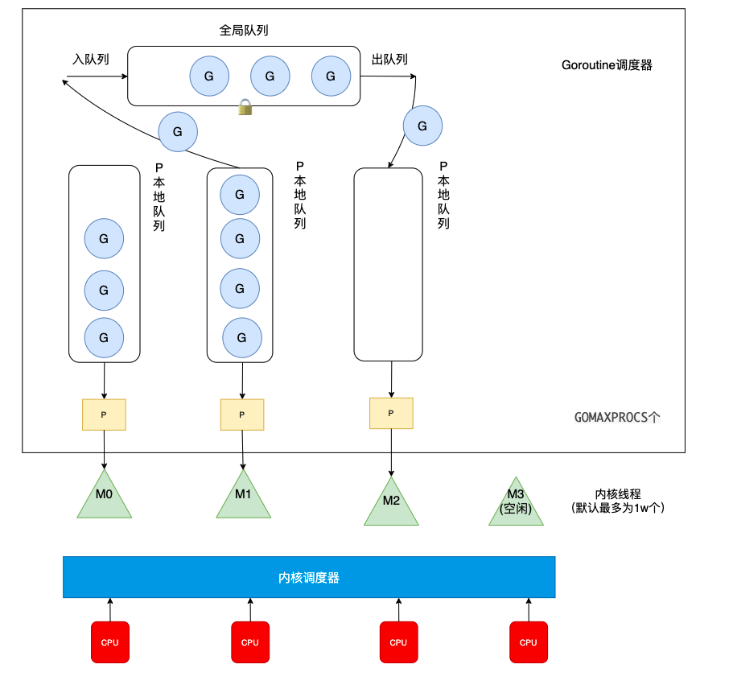

超超和面试官聊完了进程到协程发展史之后，面试官似乎想在GMP模型上超超“痛下杀手”，下面来看超超能不能接住面试官的大杀器吧！

###### 一、GM模型

面试官：你知道GMP之前用的是GM模型吗？

超超：这个我知道，在12年的go1.1版本之前用的都是GM模型，但是由于GM模型性能不好，饱受用户诟病，之后官方对调度器进行了改进，变成了我们现在用的GMP模型。

面试官：那你能给我说说什么是GM模型？为什么效率不好呢？

考点：**GM模型**

超超：GM模型中的G全称为Goroutine协程，M全称为Machine内核级线程，调度过程如下

M(内核线程)从加锁的Goroutine队列中获取G(协程)执行，如果G在运行过程中创建了新的G，那么新的G也会被放入全局队列中。

很显然这样做有俩个缺点，一是获取，调度，返回G都需要获取队列锁，形成了激烈的竞争。二是M转移G没有把资源最大化利用。比如当M1在执行G1时，M1创建了G2，为了继续执行G1，需要把G2交给M2执行，因为G1和G2是相关的，而寄存器中会保存G1的信息，因此G2最好放在M1上执行，而不是其他的M。

##### 二、GMP模型

面试官：那你能给我说说GMP模型是怎么设计的吗？

考点：**GMP设计**

超超：G全称为Goroutine协程，M全称为Machine内核级线程，P全称为Processor协程运行所需的资源，他在GM的基础上增加了一个P层，下面我们来看一下他是如何设计的

全局队列：当P中的本地队列中有协程G溢出时，会被放到全局队列中

P的本地队列：P中内置的G队列，存的数量有限，不超过256个。当队列P1中的G1在运行过程中新建G2时，G2优先存放到P1的本地队列中，如果队列满了，则会把P1队列中一半的G移动到全局队列。如果P中的本地队列为空，那么他会先到全局队列中获取G，如果全局队列中也没有G，则会尝试从其他线程绑定的P中偷取一半的G。

面试官：P和M数量是可以无限扩增的吗？

考点：**GMP细节**

超超：是不能无限扩增的，无限扩增系统也承受不了呀，哈哈

P的数量：由启动时环境变量`$GOMAXPROCS`或者是由`runtime`的方法`GOMAXPROCS()`决定。

M的数量：go程序启动时，会设置M的最大数量，默认10000。但是内核很难创建出如此多的线程，因此默认情况下M的最大数量取决于内核。手动设置就需要runtime/debug中的SetMaxThreads函数，设置M的最大数量。

面试官：那P和M都是在程序运行时就被创建好了吗？

考点：**继续深挖GMP细节**

超超：P和M创建的时机是不同的

P何时创建：在确定了P的最大数量n后，运行时系统会根据这个数量创建n个P。

M何时创建：内核级线程的初始化是由内核管理的，当没有足够的M来关联P并运行其中的可运行的G时会请求创建新的M。比如M在运行G1时被阻塞住了，此时需要新的M去绑定P，如果没有在休眠的M则需要新建M。

面试官：你能给我说说当M0将G1执行结束后会怎样做吗？

考点：**G在GMP模型中流动过程**

超超：那我给你举个例子吧（：这次把整个过程都说完，看你还能问什么

​												（图片转自刘丹冰大佬[Golang的协程调度器原理及GMP设计思想](https://www.kancloud.cn/aceld/golang/1958305#4_259)）

1. 调用 go func()创建一个goroutine；
2. 新创建的G优先保存在P的本地队列中，如果P的本地队列已经满了就会保存在全局的队列中；
3. M需要在P的本地队列弹出一个可执行的G，如果P的本地队列为空，则先会去全局队列中获取G，如果全局队列也为空则去其他P中偷取G放到自己的P中
4. G将相关参数传输给M，为M执行G做准备
5. 当M执行某一个G时候如果发生了系统调用产生导致M会阻塞，如果当前P队列中有一些G，runtime会将线程M和P分离，然后再获取空闲的线程或创建一个新的内核级的线程来服务于这个P，阻塞调用完成后G被销毁将值返回；
6. 销毁G，将执行结果返回
7. 当M系统调用结束时候，这个M会尝试获取一个空闲的P执行，如果获取不到P，那么这个线程M变成休眠状态， 加入到空闲线程中。

面试官：看来你对GMP整个流程还是比较清楚的，那你再给我说说GMP相对于GM做了哪些优化吧。

考点：**GM与GMP区别**

超超：优化点有三个，一是每个 P 有自己的本地队列，而不是所有的G操作都要经过全局的G队列，这样锁的竞争会少的多的多。而 GM 模型的性能开销大头就是锁竞争。

二是P的本地队列平衡上，在 GMP 模型中也实现了 Work Stealing 算法，如果 P 的本地队列为空，则会从全局队列或其他 P 的本地队列中窃取可运行的 G 来运行（通常是偷一半），减少空转，提高了资源利用率。

三是hand off机制当M0线程因为G1进行系统调用阻塞时，线程释放绑定的P，把P转移给其他空闲的线程M1执行，同样也是提高了资源利用率。

面试官：你有没有想过队列和线程的优化可以做在G层和M层，为什么要加一个P层呢？

考点：**深挖GMP**

超超：这是因为M层是放在内核的，我们无权修改，在[前面协程的问题](https://mp.weixin.qq.com/s/VUERW8_4mi-7rtntlfW0_A)中回答过，内核级也是用户级线程发展成熟才加入内核中。所以在M无法修改的情况下，队列和M绑定，由于hand off机制M会一直扩增，因此队列也需要一直扩增，那么为了使Work Stealing 能够正常进行，队列管理将会变的复杂。因此设定了P层作为中间层，进行队列管理，控制GMP数量（最大个数为P的数量）。

面试官：你对GMP还是蛮了解的哈，那回到刚开始的话题，你知道mac中的回收站只能单开，访达窗口可以多开吧？

超超：知道呀，这是单例模式（：为什么mac这个点过不去了😫

未完待续～

如果你有什么想问超超的问题，欢迎添加我的微信，进读者群和超超一起讨论呀！

