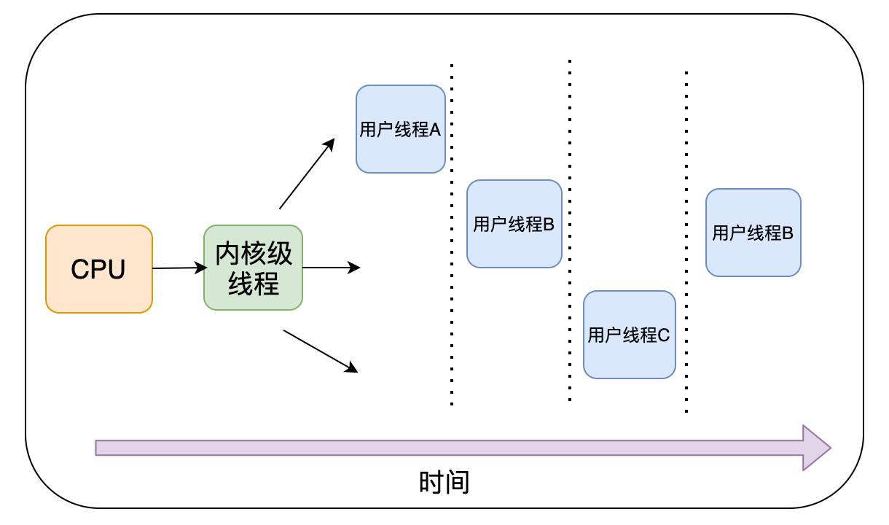

超超为了让女朋友婷婷过上幸福美满的生活，决定去大厂历练一番，下面是他在面试过程中关于操作系统的几个问题

##### 一、单进程系统

超超：面试官，您好～

面试官：你好呀，我们来简单聊会，你们平时是在Linus还是Windows上进行开发？

超超：我们用的是基于unix的macOS（：哈哈

面试官：你应该知道Linux也是基于unix开发的吧，那我们来聊一下操作系统的发展历程吧，你知道单道批处理系统吗？

考点：**单道批处理系统**

超超：这个知道的，单道批处理系统内存中始终只保持一道作业，cpu只能将内存中作业执行完毕，才能执行下一道作业，进程之间串行执行，A、B、C三个进程按顺序执行

​	单道批处理系统不用考虑并发问题，程序设计较为简单，但是每次只能执行一个进程功能过于单一，且当进程存在大量IO操作时，会造	成CPU资源的浪费。

##### 二、多进程

面试官：那你知道分时系统的机制吗？

考点：**多进程程序**

超超：知道的，分时系统引申出了时间片的概念，进程按照调度算法分时间片在CPU上执行，A、B、C三个进程按照时间片并发执行

这样做有俩个优点，一是对于单个核可以并发执行多个进程，应用场景更加丰富，二是当某个进程是IO密集型进程时，也能保证CPU的利用率。但是随着时代的发展，CPU通过进程来进行调度的缺点也越发的明显。大量的进程切换，创建和销毁，将浪费大量的CPU资源。如果一个程序比较复杂，那么大量的进程之间通讯也会给系统带来负担。

面试官：那后来进行了怎样的改进了？

考点：**多线程**

超超：后来引入了线程的概念，在进程的基础上再细分出线程，线程比进程更轻量，线程之间的通信也更为便捷，任务的最小载体变成了线程。

这样一来当一个进程中有线程阻塞时，不妨碍其他线程的执行。并且内核级线程只有很小的数据结构和堆栈，切换速度快。

面试官：你刚刚提到了内核级线程，那你知道内核级线程和用户级线程的区别吗？

考点：**线程知识点广度**

超超：嘿嘿，这个我也研究过的

用户线程：刚有线程概念时，线程只能在用户态中执行，因此线程的调度由用户态进程中的调度器执行，对于内核来说调度的仍是进	程，因此如果一个进程中的某一个线程发生阻塞，那么整个进程中的线程都无法执行。

内核线程：后来线程的技术逐步成熟，则在内核中添加了内核级线程，此时CPU调度的最小单位就变为线程。

##### 三、协程

面试官：嗯，不错！那线程这么好，为什么我们还要引入协程呢？

考点：**协程**

超超：随着时代的发展，为每个任务都创建一个线程是不现实的，因为会消耗大量的内存(进程虚拟内存会占用4GB[32位操作系统], 而线程也要大约4MB)。同时多线程也会给内核的调度管理带来巨大的压力。基于线程所占空间较大和内核调度压力大这俩个缺点，可以将线程做的更加轻量级，因此将协程抽象成线程，并在用户空间做协程的管理，减小内核的压力。

协程占用的内存更小（几kb），而线程通常需要4M。并在用户层再封装一次调度，减轻内核负担。

面试官：以后觉得协程大了，不知道还会不会再细分哈，那我们再聊一下Goroutine调度器吧。

超超：可以啊（：还好这个知识点在「Golang面试宝典看过」

未完待续～

欢迎添加我的微信，进读者群

