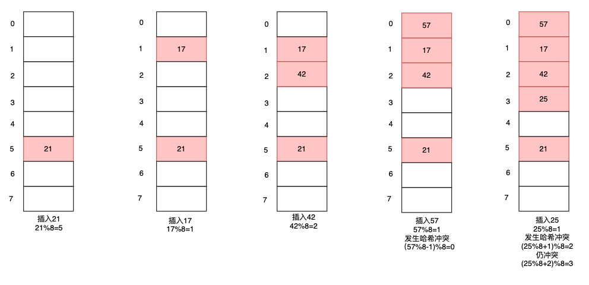

超超经过了一番磨难通过了面试官单例的灵魂拷问，面试官貌似想通过一道场景应用题来考验超超对Golang的容器是否足够熟悉。下面来看看超超是如何解答的吧！


##### 一、红黑树和哈希表

面试官：那我们来看这样一个问题，你看废纸篓（回收站）里面有图片，文件夹，app等各种文件，把这个抽象成各种不同类型的数据，你会用什么容器去存储他？

考点：**Golang容器特点**

超超：go语言中可以批量存储的基础数据类型有map、slice、array，以及container包中的容器heap，list，ring。如果是存储的是不同数据类型，那么容器的值类型应该是interface。废纸篓中的文件数量在使用时波动还是挺大的，因此可以排除array，废纸篓中往往有按日期或者修改时间排序的功能，所以用heap比较好。


面试官：那我们先挑一个工作中比较常用的map来说一下吧，我看你还学过C++，那你能给我说说C++中的map和go语言中的map有什么区别吗？

考点：**哈希表和红黑树**

超超：C++中的map底层用的是红黑树，而Go语言中的map底层用的是哈希表。下面我来分别介绍一下这俩种数据结构吧。

哈希表：哈希表又称散列表，是一种线性结构，可以通过键直接访问到内存中的值，时间复杂度为O(1)。他由计算键值的哈希函数和存储值的线性表俩部分构成。


红黑树：是一种自平衡二叉查找树，利用查找树左子树上所有节点的值均小于它的根节点的值，右子树上所有节点的值均大于它的根节点的值，这样俩个性质可以快速在树中查找到目标值，时间复杂的为O(longn)。


面试官：哈希表和红黑树的优缺点是什么呢？

考点：**使用场景**

超超：那我从时间复杂度，空间复杂度和有序性三个方面比较一下吧。

时间复杂度：红黑树查询的时间复杂度是O(logn)，哈希表查询的时间复杂度是O(1)。但看复杂度似乎任何场景下哈希表都比红黑树更优，其实不然，哈希表需要用hash函数进行处理才可以用键取到对应的值，而红黑树查询操作是不需要进行额外操作的。当存储的数据量比较小时，用哈希函数的时间损耗就无法忽略了，此时用红黑树更佳。


空间复杂度：哈希表是有额外空间浪费的，因为存储值的线性表空间需要预设，当存储的数据量较少时，表中是存在空闲内存的。而红黑树无论数据量多少都不会存在浪费空间的问题。

有序性：红黑树用for range便利是有序的，而哈希表便利结果是无序的，并且在go语言中为了让开发人员注意到这一点，作者在range时特意封装了一层，加入了随机种子，这样便利顺序更加的混乱。但是红黑树为了维持有序性和红黑节点的平衡性，在增删改节点时，可能都需要进行旋转操作，而哈希表只需要用哈希函数重新计算键值即可。

因此在需要一定量增删改操作的场景下用哈希表时间上表现更好，在元素数据量较少，需要保证元素有序性或者注重内存损耗的场景下用红黑树更佳。


面试官：既然Go语言中的map是用哈希表实现的，那我们就来重点说一下哈希表吧，你知道哈希冲突是什么吗？常用的解决方式又是什么呢？

考点：**哈希冲突**

超超：哈希冲突是指可能存在两个不同的初始值在经过哈希运算后得到同样的结果，比如现在有1-10十个数字，要将他们存到容量只有9的哈希表中，此时必然会出现哈希冲突。常用的哈希冲突的解决办法有链地址法，开放定址法。

链地址法：将产生哈希冲突的元素用链表串起来，并将表头指针存放在线性表的相应桶中。举个例子，假设哈希函数为H(key)=(Hash(key)±d) MOD m，其中m为散列表长度设为7，现在我们将一组数{21,17,42,57,25}存到哈希表中。


开放地址法：开放地址法又分为线性探查法，平方探查法。他们区别在于哈希函数的不同，线性探查法的哈希函数为H(key)=(Hash(key)±d) MOD m，当发生哈希冲突时，d会以±(d+1)的方式扩散后再用哈希函数去计算值。而平方探查法中哈希函数为H(key)=(Hash(key)±d²) MOD m，当发生哈希冲突时，d会以±(d+1)²方式扩散再用哈希函数去计算值。下面以线性探查法为例。



面试官：那你可以给我说一下链地址法和线性探查法的优缺点？

考点：**哈希冲突解决方式**

超超：可以的，这个就设计到了哈希表中的一个很重要的概念**载荷因子**，载荷因子是用来描述线性表中元素的稀疏程度的，他的计算公式为：装载因子=填入表中的元素个数 / 散列表的长度。载装因子越大表示线性表中元素越多，发生哈希冲突的可能性就越大。在go语言中如果载荷因子大于0.65就需要扩容了。

链地址法优点在于当载荷因子较大时，可以将数据链在桶的后面，虽然当桶后链表的长度等于线性表长度时也会扩容，但是与线性探查法相比多了一个存储的地方，避免频繁的扩容。缺点在于载荷因子较小时，线性表中大量空闲的桶空间就发生了内存浪费。


线性探查法优点在于当载荷因子较小时，可以将线性表中更多的桶利用起来，减少内存资源的浪费。缺点在于当载荷因子较大时，线性探查会经历大量的哈希碰撞，性能不高，且需要频繁的扩容。


##### 二、map的遍历

面试官：你刚刚提到了在遍历map时，go用了一个随机种子来使得每次遍历结果都是不一样的，这个可以详细给我说一下吗？

考点：**map底层实现**

超超：那我先介绍一下map的底层结构吧，map由结构体hmap构成

**hmap**

```go
type hmap struct {
	// Note: the format of the hmap is also encoded in cmd/compile/internal/gc/reflect.go.
	// Make sure this stays in sync with the compiler's definition.
  count     int // 哈希表中元素个数，即len(map)的返回值
	flags     uint8
  B         uint8  // 线性表中桶个数的的对数log_2(哈希表元素数量最大可达到装载因子*2^B)
	noverflow uint16 // 溢出桶的大概数字;详情见incrnoverflow
	hash0     uint32 // 哈希种子

	buckets    unsafe.Pointer // 指向线性表的指针，数组大小为2^B，如果元素个数为0，它为nil.
	oldbuckets unsafe.Pointer // 指向扩容后的老线性表地址
	nevacuate  uintptr        // 表示扩容进度

	extra *mapextra // 垃圾回收用
}
```

**bmap结构体**

```go
// A bucket for a Go map.
2type bmap struct {
3    // tophash包含此桶中每个键的哈希值最高字节（高8位）信息（也就是前面所述的high-order bits）。
4    // 如果tophash[0] < minTopHash，tophash[0]则代表桶的搬迁（evacuation）状态。
5    tophash [bucketCnt]uint8
6}
```

为了便于理解，示意图如下所示


在顺序遍历时会用随机种子产生一个随机数，表示开始遍历的桶位置，因为随机数每次产生的数字可能都是不同的，所以每次for range得到的结果也是不同的。以下为初始化哈希迭代器的方法源码:

```go
func mapiterinit(t *maptype, h *hmap, it *hiter) {
	if raceenabled && h != nil {
		callerpc := getcallerpc()
		racereadpc(unsafe.Pointer(h), callerpc, funcPC(mapiterinit))
	}

	if h == nil || h.count == 0 {
		return
	}

	if unsafe.Sizeof(hiter{})/sys.PtrSize != 12 {
		throw("hash_iter size incorrect") // see cmd/compile/internal/gc/reflect.go
	}
	it.t = t
	it.h = h

	// grab snapshot of bucket state
	it.B = h.B
	it.buckets = h.buckets
	if t.bucket.ptrdata == 0 {
		// Allocate the current slice and remember pointers to both current and old.
		// This preserves all relevant overflow buckets alive even if
		// the table grows and/or overflow buckets are added to the table
		// while we are iterating.
		h.createOverflow()
		it.overflow = h.extra.overflow
		it.oldoverflow = h.extra.oldoverflow
	}

	// 产生随机数
	r := uintptr(fastrand())
	if h.B > 31-bucketCntBits {
		r += uintptr(fastrand()) << 31
	}
  //决定桶的开始位置
	it.startBucket = r & bucketMask(h.B)
  //决定桶中bmap的开始位置
	it.offset = uint8(r >> h.B & (bucketCnt - 1))

	// iterator state
	it.bucket = it.startBucket

	// Remember we have an iterator.
	// Can run concurrently with another mapiterinit().
	if old := h.flags; old&(iterator|oldIterator) != iterator|oldIterator {
		atomic.Or8(&h.flags, iterator|oldIterator)
	}

	mapiternext(it)
}
```


面试官：那map在什么时候会扩容呢？

考点：**map扩容方式**

超超：有俩种方式会导致map的扩容，另一种是由于桶后面跟的链表太长所导致的扩容。

载荷因子引起：当元素个数 >= 桶（bucket）总数 * 6.5，这时说明大部分桶都被占满了如果再来元素，大概率会发生哈希冲突。因此需要扩容，扩容方式为将 B + 1，新建一个buckets数组，新的buckets大小是原来的2倍，然后旧buckets数据搬迁到新的buckets。该方法我们称之为**增量扩容**。如下图所示，插入25时会经历大量哈希冲突，再插入元素时6/8=0.67就需要扩容了。


链表长度引起：判断溢出桶是否太多，当桶总数 < 2 ^ 15 时，如果溢出桶总数 >= 桶总数，则认为溢出桶过多。当桶总数 >= 2 ^ 15 时，直接与 2 ^ 15 比较，当溢出桶总数 >= 2 ^ 15 时，即认为溢出桶太多了。buckets数量维持不变，将长度过长的溢出桶搬运到[]bmap的其他桶上，该方法我们称之为**等量扩容**。如下图所示，每一个溢出桶可以存八个元素，为了画图方便这里老虎就只当做只能存一个元素处理了，当插入元素41时，链表长度已经达到了5，如果哈希冲突过多，那么会最终演变为遍历访问链表，时间复杂度为O(n)的算法了！


##### 三、拓展

面试官：如果我想要遍历的结果的是有序的该怎么做呢？

考点：**容器组合使用**

超超：这里就需要申请一个辅助容器slice用来存储key的次序，然后顺序遍历slice获取到有序的key，再到map中获取value，代码如下

```go
package main

import (
	"fmt"
	"sort"
)

func main() {
  //创建class包括超超和婷婷俩个对象
	class := map[int]string{1: "chaochao", 2: "tingting"}
  //辅助有序遍历的ids切片
	ids := make([]int, 0, 10)
	for k, _ := range class {
		ids = append(ids, k)
	}
  
  //对id进行排序
	sort.Ints(ids)
	for _, v := range ids {
    //根据有序切片取出
		fmt.Println(class[v])
	}

}
```

这是一个最简单的原型，如果map中元素中是不断变化的，可以将slice和map封装在一起。一个简易的排序map代码如下：

```go
package main

import (
	"container/list"
	"fmt"
)

//Map结构体
type Map struct {
	ids   *list.List
	class map[interface{}]interface{}
}

//创建一个Map
func NewMap() *Map {
	m := &Map{
		ids:   list.New(),
		class: make(map[interface{}]interface{}),
	}
	return m
}

//向Map中添加元素
func (p *Map) push(id int, name string) bool {
	if p.class[id] != nil {
		return false
	}
	p.ids.PushBack(id)
	p.class[id] = name
	return true
}

//对ids排序，通过ids的顺序遍历获取names
func (p *Map) getNames() []interface{} {
	names := make([]interface{}, 0, p.ids.Len())
	//sort(p.ids)对list排序，篇幅有限读者可自行实现
	for i := p.ids.Front(); i != nil; i = i.Next() {
		names = append(names, p.class[i.Value])
	}
	return names
}

func main() {
	m := NewMap()
	m.push(1, "chaochao")
	m.push(2, "tingting")
	names := m.getNames()
	for k, v := range names {
		fmt.Println(k, v)
	}
}
```


面试官：确实很简陋哈，但是还比较容易理解。那如果我要实现一个set该怎么做呢？

考点：**容器组合使用**

超超：STL中的set也是有序的，且只有值没有键，因此不需要用list对key排序了，直接获取key排序即可。代码如下

```go
package main

import (
	"fmt"
)

//定义Set结构体
type Set struct {
	class map[interface{}]bool
}

//创建一个Set
func NewSet() *Set {
	s := &Set{
		class: make(map[interface{}]bool),
	}
	return s
}

//向Set中添加元素
func (p *Set) push(id int, name string) bool {
	if p.class[id] {
		return false
	}
	p.class[name] = true
	return true
}

//对class中的key排序
func (p *Set) getNames() []interface{} {
	names := make([]interface{}, 0, len(p.class))
	for k, _ := range p.class {
		names = append(names, k)
	}
	//sort(names)
	return names
}

func main() {
	m := NewSet()
	m.push(1, "chaochao")
	m.push(2, "tingting")
	names := m.getNames()
	for k, v := range names {
		fmt.Println(k, v)
	}
}
```


面试官：map的并发问题，我们等下再问吧，先看这样一个问题。你看废纸篓中的文件是可以按名称排序的，假设文件的名称都可以用ASCII码转化成一个具体的数字，比如“plan.txt”将每位字母转化成数字后相加最终结果为825，现在要求你设计一个find方法可以用文件名快速查到对应的位置该怎么做。

超超：（：为什么我的面试题终逃不过mac( ･᷄ὢ･᷅ )


未完待续～


参考：

菜刀兄[Go是如何设计Map的](https://mp.weixin.qq.com/s/q3qyc5uf3IMVt4KQD12IKQ)(强烈推荐阅读)

维基百科[哈希表](https://zh.wikipedia.org/zh-hans/%E5%93%88%E5%B8%8C%E8%A1%A8)


