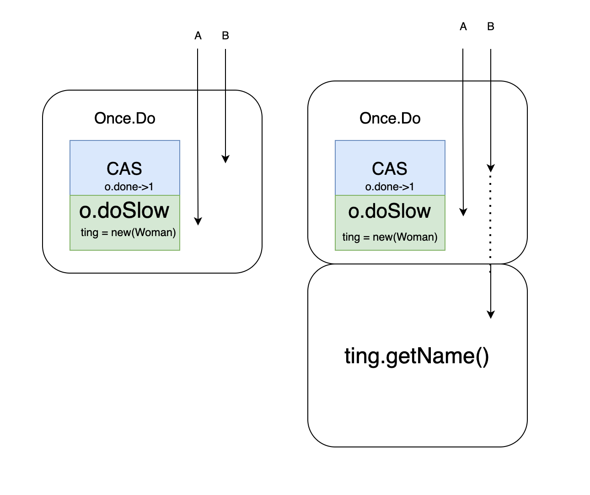
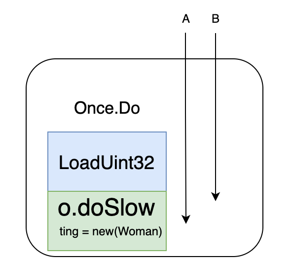

#### 一、前言

超超为了能让婷婷过上幸福美满的生活，决定去大厂历练一番，下面是他去大厂面试时遇到的几个关于单例的问题

#### 二、认识单例

面试官：不知道你有没有注意到windows的资源管理器只能单开，但是cmd命令行可以开很多个，这是为什么呢？

考点：单例的使用场景优缺点

超超：这是因为资源管理器整个系统运行过程中不会因为不同的任务管理器内容改变而改变，因此为了节省资源全局只需要有一份

#### 三、单例怎么用

面试官：你刚才说到了单例，你知道go里面怎么使用单例怎么用吗？

考点：go如何使用单例

超超：这个简单，举个例子，婷婷在购物时，android端和web端只有一个指向用户婷婷的对象

```go
package main

import (
	"fmt"
	"sync"
)

//婷婷的淘宝客户端和web端都会指向婷婷这一个人
type Woman struct {
	name string
}

var (
	once sync.Once
	ting *Woman
)

func getTing() *Woman {
	once.Do(func() {
		ting = new(Woman)
		ting.name = "tingting"
		fmt.Println("newtingting")
	})
	fmt.Println("gettingting")
	return ting
}

func main() {
	for i := 0; i < 3; i++ {
		_ = getTing()
	}
}
```

结果

```go
newtingting
gettingting
gettingting
gettingting
```

#### 四、源码

面试官：那你能说说sync.once是怎么实现的吗（举个例子还秀起来了

考点：深入源码，进一步了解once

超超：sync.once是由Once结构体和Do，doSlow俩个结构体方法实现的

```go
type Once struct {
	// done indicates whether the action has been performed.
	// It is first in the struct because it is used in the hot path.
	// The hot path is inlined at every call site.
	// Placing done first allows more compact instructions on some architectures (amd64/x86),
	// and fewer instructions (to calculate offset) on other architectures.
	done uint32
	m    Mutex
}
```

done是标识位，用来判断方法f是否被执行完，其初始值为0，当f执行结束时，done被设为1。

m做竞态控制，当f第一次执行还未结束时，通过m加锁的方式阻塞其他once.Do执行f

因此这里需要有个地方特别注意下，once.Do是不可以嵌套使用的，嵌套使用会导致内层m始终处于阻塞状态，从而导致死锁

```go
func (o *Once) Do(f func()) {
	// Note: Here is an incorrect implementation of Do:
	//
	//	if atomic.CompareAndSwapUint32(&o.done, 0, 1) {
	//		f()
	//	}
	//
	// Do guarantees that when it returns, f has finished.
	// This implementation would not implement that guarantee:
	// given two simultaneous calls, the winner of the cas would
	// call f, and the second would return immediately, without
	// waiting for the first's call to f to complete.
	// This is why the slow path falls back to a mutex, and why
	// the atomic.StoreUint32 must be delayed until after f returns.

	if atomic.LoadUint32(&o.done) == 0 {
		// Outlined slow-path to allow inlining of the fast-path.
		o.doSlow(f)
	}
}

func (o *Once) doSlow(f func()) {
	o.m.Lock()
	defer o.m.Unlock()
	if o.done == 0 {
		defer atomic.StoreUint32(&o.done, 1)
		f()
	}
}
```

Do()方法：

作用：通过原子操作判断o.done与0的关系，如果o.done==0则f未被执行完，进入doSlow(f func())，如果f执行完则退出Do()

入参：无

出参：无

doSlow(f func())方法：

作用：通过加锁的方式，执行f，并在f执行结束时，将o.done置为1

入参：执行体f，通常为对象的创建或者模块数据加载

出参：无


面试官：你知道atomic.CompareAndSwapUint32(&o.done, 0, 1)的作用是什么吗？

考点：对sync包了解的广度

超超：CompareAndSwapUint32简称CAS，通过原子操作判断当o.done值等于0时，使o.done等于1并返回true，当o.done值不等于0，直接返回false


面试官：很好，那你能说说Do方法中可以把atomic.LoadUint32直接替换为atomic.CompareAndSwapUint32吗？

考点：多线程思维

超超：这个是不可以的，因为f的执行是需要时间的，如果用CAS可能会导致f创建的对象尚未完成，其他地方就开始调用了，图中为A,B俩个协程都调用Once.Do方法，A协程先完成CAS将done值置为了1，导致B协程误以为对象创建完成



这里doSlow中o.done == 0也需要注意一下，因为可能会出现A,B俩个协程都进行了LoadUint32判断，如果不进行第二次校验的话，对象会被new俩次



#### 五、拓展

面试官：看来你对源码还比较属性，那你知道懒汉模式和饿汉模式吗？

考点：单例创建的延伸

超超：

饿汉模式：是指在程序启动时就进行数据加载，这样避免了数据冲突，也是线程安全的，但是可能会造成内存浪费，比如在程序启动时就new一个 woman对象加载婷婷相关数据，当需要调用婷婷相关方法时，不用再创建对象

懒汉模式：是指需要执行对象相关方法时，才主动去加载数据，这样做可以避免内存的浪费，比如当需要调用婷婷相关的方法时，再去new一个 woman对象加载婷婷相关数据，然后调用方法

