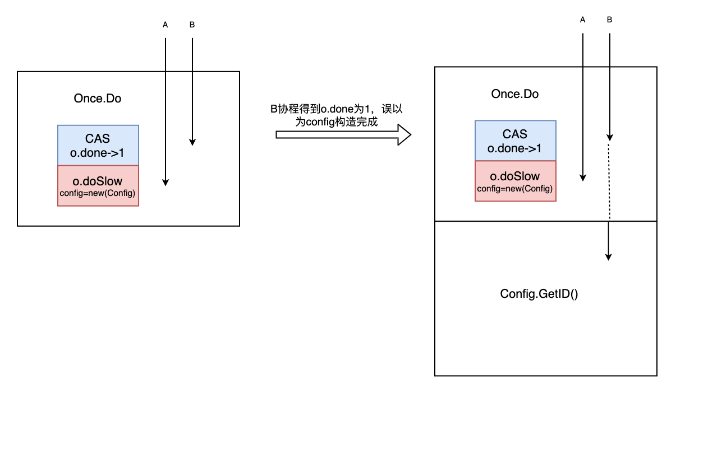

超超艰难的回答完了面试官关于GMP相关问题，下面进入到了单例相关问题。单例虽然简单，但是面试官也是层层深入，让超超满头大汗，下面来看看单例面试官都问了些什么吧。

#### 一、认识单例

面试官：你知道mac中的回收站只能单开，访达窗口可以多开吧？

考点：**单例的使用场景优缺点**

超超：知道呀，这是单例模式。我们日常工作中并没有使用俩个废纸篓的必要性，且废纸篓之间的资源是共享，没有必要多开浪费系统资源，这就是单例模式。

#### 二、单例怎么用

面试官：你刚才说到了单例，你知道go里面怎么使用单例吗？

考点：**sync.Once使用**

超超：这个简单，举个例子，平时我们在构建项目时，因为配置信息在全局是资源共享的，所以会将读取配置信息的对象做成一个单例

```go
package main

import (
	"fmt"
	"sync"
)

//假设配置信息中只有服务器id
type Config struct {
	id int
}

var (
	once   sync.Once
	config *Config
)

func getConfig() *Config {
	//底层是俩个锁，防止f没执行完，其他new因未获取到锁，直接返回对象
	once.Do(func() {
		config = new(Config)
		config.id = 1
		fmt.Println("new config")
	})
	fmt.Println("get config")
	return config
}

func main() {
	for i := 0; i < 3; i++ {
		_ = getConfig()
	}
}
```

结果

```go
new config
get config
get config
get config
```

#### 三、源码实现

面试官：那你知道`sync.Once`底层结构是什么吗？

考点：**sync.Once源码**

超超：`sync.Once`是由`Once`结构体和`Do`，`doSlow`俩个方法实现的

```go
type Once struct {
	// done indicates whether the action has been performed.
	// It is first in the struct because it is used in the hot path.
	// The hot path is inlined at every call site.
	// Placing done first allows more compact instructions on some architectures (amd64/x86),
	// and fewer instructions (to calculate offset) on other architectures.
	done uint32
	m    Mutex
}
```

`done`是标识位，用来判断方法`f`是否执行结束，其初始值为0，当`f`执行结束时，`done`被设为1。

`m`做竞态控制，当`f`执行仍在执行状态时，通过`m`加锁的方式阻塞其他`once.Do`执行`f`。

这里有个地方需要特别注意下，`once.Do`是不可以嵌套使用的，嵌套使用将导致死锁。

```go
func (o *Once) Do(f func()) {
	// Note: Here is an incorrect implementation of Do:
	//
	//	if atomic.CompareAndSwapUint32(&o.done, 0, 1) {
	//		f()
	//	}
	//
	// Do guarantees that when it returns, f has finished.
	// This implementation would not implement that guarantee:
	// given two simultaneous calls, the winner of the cas would
	// call f, and the second would return immediately, without
	// waiting for the first's call to f to complete.
	// This is why the slow path falls back to a mutex, and why
	// the atomic.StoreUint32 must be delayed until after f returns.

	if atomic.LoadUint32(&o.done) == 0 {
		// Outlined slow-path to allow inlining of the fast-path.
		o.doSlow(f)
	}
}

func (o *Once) doSlow(f func()) {
	o.m.Lock()
	defer o.m.Unlock()
	if o.done == 0 {
		defer atomic.StoreUint32(&o.done, 1)
		f()
	}
}
```

- `Do()`方法

作用：通过原子操作判断`o.done`，如果`o.done==0`则`f`未被执行完，进入`doSlow(f func())`，如果`f`执行完则退出`Do()`。

入参：无

出参：无

- `doSlow(f func())`方法

作用：执行`f`，f在运行状态时通过m锁住运行区间，并在`f`执行结束时，将`o.done`置为1

入参：执行体`f`，通常为对象的创建或者模块数据加载

出参：无

如果`once.Do`发送嵌套使用，那么内层将永远得不到互斥锁m，从而导致死锁。


面试官：你知道`atomic.CompareAndSwapUint32(&o.done, 0, 1)`的作用是什么吗？

考点：**对sync包了解的广度**

超超：`CompareAndSwapUint32`简称CAS，通过原子操作判断当`o.done`值等于0时，使`o.done`等于1并返回`true`，当`o.done`值不等于0，直接返回`false`


面试官：很好，那你能说说`Do()`方法中可以把`atomic.LoadUint32`直接替换为`atomic.CompareAndSwapUint32`吗？

考点：**多线程思维**

超超：这个是不可以的，因为`f`的执行是需要时间的，如果用CAS可能会导致`f`创建的对象尚未完成，其他地方就开始调用了。如图所示，A,B俩个协程都调用`Once.Do`方法，A协程先完成CAS将`done`值置为了1，导致B协程误以为对象创建完成，继而调用对象方法而出错。



这里`doSlow`中对`o.done == 0`进行第二次判断也需要注意一下，因为可能会出现A,B俩个协程都进行了`LoadUint32`判断，并且都是`true`，如果不进行第二次校验的话，对象会被new俩次。


#### 四、拓展

面试官：看来你对源码`sync.Once`的实现还比较熟悉，那你知道懒汉模式和饿汉模式吗？

考点：**单例创建的延伸**

超超：

饿汉模式：是指在程序启动时就进行数据加载，这样避免了数据冲突，也是线程安全的，但是这可能会造成内存浪费。比如在程序启动时就构建Config对象，加载配置信息，但是如果全局都没有用到Config对象，就会造成内存浪费。

懒汉模式：是指程序需要config对象时，再主动去加载数据，这样做可以避免内存的浪费，比如当需要调用Config对象获取数据时，再去new一个Config对象，然后通过对象获取配置相关信息。


面试官：看来对这个研究过哈，那不知道这个你有没有研究过呢？

超超：啊！？

未完待续 ~

