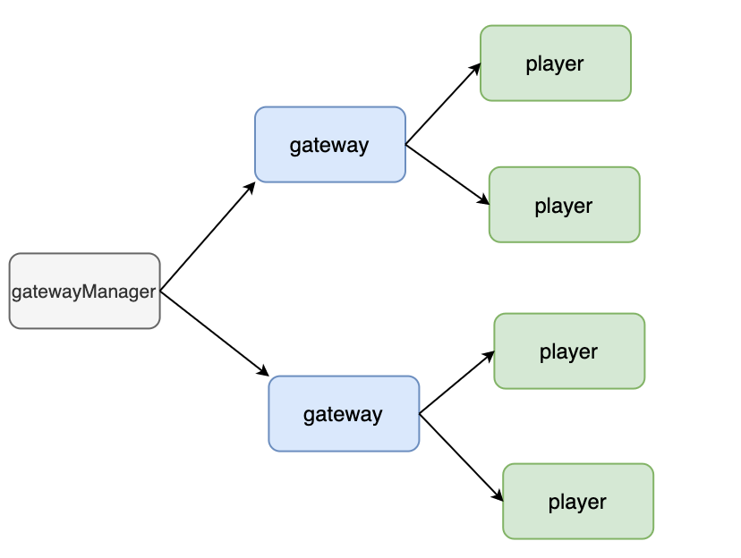

#### 前言

gameServer有多个gateway连接，gatewaymanager需要管理这些gateway，gateway需要管理player，当player需要向所有gateway广播消息的时候，需要调gateway Manager去广播（可以理解为校长管理老师，老师管理你，有天你不爽了，想调校长当众教育下老师（我的区长父亲））



代码结构如下

.
├── gatewaymanager
│   └── gateway.go
├── main.go
├── player
│   └── player.go
└── send
    └── send.go

代码如下

circularreference/gatewaymanager/gateway.go

```go
package gatewaymanager

import (
	"circularreference/player"
	"fmt"
)

type Gateway struct {
	players []*player.Player
}

func Send(player *player.Player) {
	fmt.Println("send all gateway", player.GetName())
}
```

circularreference/player/player.go

```go
package player

import "circularreference/gatewaymanager"

type Player struct {
	name string
}

func (p *Player) Send() {
	gatewaymanager.Send(p)
}

func (p *Player) GetName() string {
	return p.name
}

func NewPlayer(name string) *Player {
	p := &Player{name: name}
	return p
}
```

circularreference/main.go

```go
package main

import "circularreference/player"

func main() {
	huang := player.NewPlayer("huang")
	huang.Send()
}

```

#### 共用模块抽离

按照主次关系，矛盾在于player是不能包含gateway manager的，因此想调用gateway manage中的send方法，可以把send剥离出来做成一个send包，将player作为参数传递

circularreference/send/send.go

```go
package send

import (
	"circularreference/gatewaymanager"
	"circularreference/player"
)

func Send(player *player.Player) {
	gatewaymanager.Send(player)
}
```

circularreference/main.go

```go
package main

import (
	"circularreference/player"
	"circularreference/send"
)

func main() {
	huang := player.NewPlayer("huang")
	send.Send(huang)
}
```

这样做会导致send包有点不伦不类

#### 函数传递

circularreference/player/player.go

```go
package player

type Player struct {
	name string
}

func (p *Player) Send(f func(*Player), player *Player) {
	//gatewaymanager.Send(p)
	//send.Send(p)
	f(player)
}

func (p *Player) GetName() string {
	return p.name
}

func NewPlayer(name string) *Player {
	p := &Player{name: name}
	return p
}
```

circularreference/main.go

```go
package main

import (
	"circularreference/gatewaymanager"
	"circularreference/player"
)

func main() {
	huang := player.NewPlayer("huang")
	huang.Send(gatewaymanager.Send, huang)
}

```

这种方法耦合度还是很高，只有调用的send包不是gateway manager所引用的才能使用，比仍在player中调用send，那么仍会导致循环引用

#### 外观模式

用接口作为基础类，其他类去继承