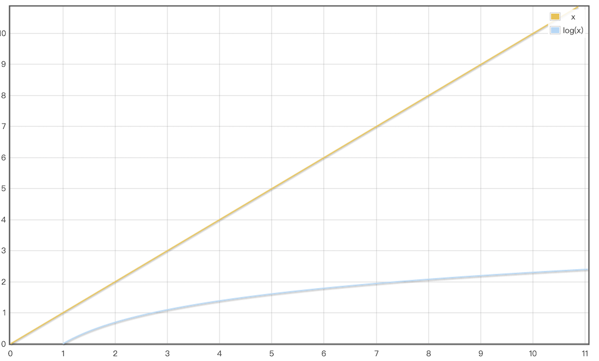
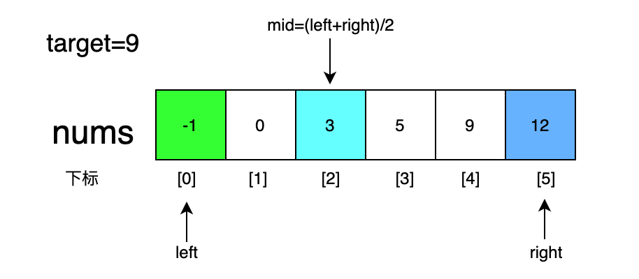
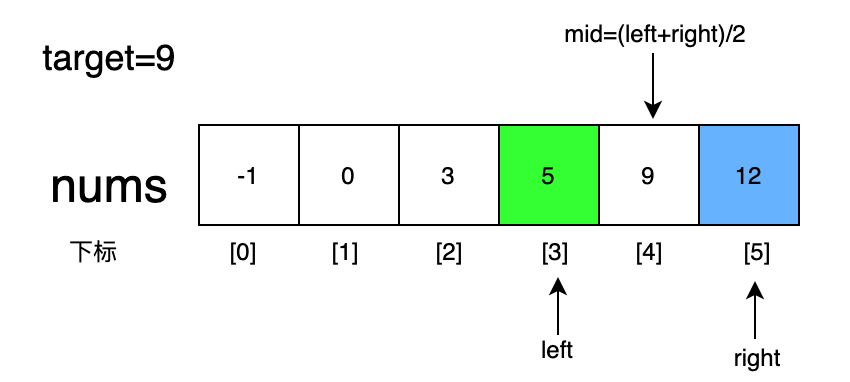
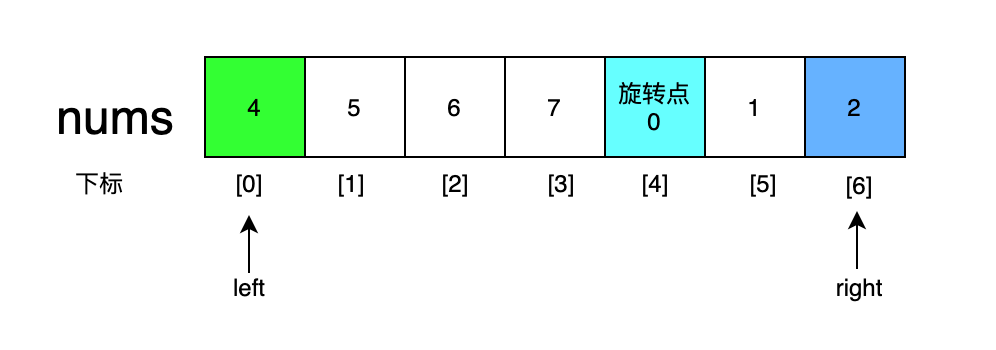
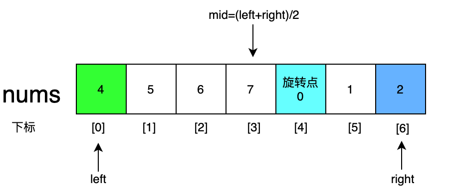

### 一、前言

1. 无论是工作中，生活中，刷题时，查找都是非常常见的场合，很多同学对于数组中查找某一元素，第一反应都是线性查找，即for循环从nums[0]遍历到nums[n-1]，这样时间复杂度是O(n)，如果是使用二分法不断折半区间的方法，时间复杂度仅为O(logn)，看似不高，当数据量较大时，我们来看一下俩者区别

   

   很多超时问题是不是都有解决的思路了？

2. 还有一些同学会二分法，但是一写就容易出错，据说能一次写对二分法的程序员只有10%。这是因为他们忽略了二分法的定义和一些细节，当遇到多变的场景时就容易在出错，本文将从二分法定义出发，给出二分法常见出错点，题目变化，以及应对方法，帮助大家下次写二分法时正确率能提高到90%！

### 二、什么是二分法

维基百科二分法**定义**如下

*在计算机科学中，二分查找算法也称折半搜索算法，对数搜索算法，是一种在**有序数组**中查找**某一特定元素**的搜索算法。搜索过程从数组的中间元素开始，如果中间元素正好是要查找的元素，则搜索过程结束；如果某一特定元素大于或者小于中间元素，则在数组大于或小于中间元素的那一半中查找，而且跟开始一样从中间元素开始比较。如果在某一步骤数组为空，则代表找不到。这种搜索算法每一次比较都使搜索范围缩小一半。*

第一句话我们抓住俩个关键词，一是有序数组（这里可能是整体有序比如[1,2,3,4,5]，也有可能是局部有序比如[4,5,1,2,3]），二是特定元素（也有可能是满足特定的条件）。由定义我们大概就知道了二分法的应用场景，在有序数组中找特定值都可以考虑用二分法。

第二句话说的是二分法的核心，每一次比较都使搜索范围缩小一半。文字比较绕，下面将通过一个案例，帮助大家进一步了解这句话

#### 问题

给定一个 `n` 个元素有序的（升序）整型数组 `nums` 和一个目标值 `target` ，写一个函数搜索 `nums` 中的 `target`，如果目标值存在返回下标，否则返回 `-1`。

##### 示例 :

```
输入: nums = [-1,0,3,5,9,12], target = 9
输出: 4
解释: 9 出现在 nums 中并且下标为 4
```

##### 分析：

二分法题目都可以分下面三步

第一步确定是否满足二分法的使用条件，**有序数组与查找特定元素**，题目中nums有序，查找的是指定元素target，满足条件

第二步确定特定元素target的伪代码，这题比较简单就是nums[mid]==target

第三步确定边界的变化，根据定义的第二句话，写出代码如下

```go
if nums[mid] > target {	//当中间值大于目标值时在左半边，改变right值
			right = mid - 1	
		} else if nums[mid] < target {	//当中间值小于目标值时在右半边，改变left值
			left = mid + 1
		} else if nums[mid] == target {	//当目标值等于中间值时就找到那个元素了
			return mid
		}
}
```

整个过程如下



nums[mid]<target，因此target是在mid的右边区域，让left=mid+1，在mid右半边区域查找nums[mid]==target，俩次就找到了这个数，时间复杂度为O(logn)

完整代码如下

```go
func search(nums []int, target int) int {
	left := 0
	right := len(nums) - 1	
	for left <= right {	//注意
		mid := left + (right-left)>>1
		if nums[mid] > target {	
			right = mid - 1	//注意
		} else if nums[mid] < target {
			left = mid + 1
		} else if nums[mid] == target {
			return mid
		}
	}
	return -1
}
```

再将代码进一步抽象成模板如下

```go
func search(nums []int, target int) int {
	left := ...
	right := ...
	for 满足循环的条件{	
		mid := left + (right-left)>>1
		if nums[mid] > target {	
			right = ... //target在右半边
		} else if nums[mid] < target {
			left = ...	//target在左半边
		} else if nums[mid] == target {
			return mid	//找到目标元素
		}
	}
	return -1
}
```

二分法都是在这套模板上变形，外层的for循环以及left和right的变动是帮助我们不断的缩小范围，当满足条件nums[mid] == target时就可以退出循环，代码看似不难，但是易错点很多，试着独立思考下面这个问题。

#### 问题

循环条件写left <= right和left < right的区别是什么？模板需要进行哪些改动？

区别在于是否包含最右边的边界值，因为当left==right时，不会再进入循环体，所以right初始化时就取值为len(nums)，这样在for循环中就能保证是在这样一个左闭右开的区间[left,right)，且right赋值应该为right = mid而非right = mid-1，因为右半边是开区间，取mid-1就无法验证到mid-1是否是目标值

```go
func search(nums []int, target int) int {
	left := 0
	right := len(nums)
	for left < right {
		mid := (left + right) >> 1
		if nums[mid] < target {
			left = mid + 1
		} else if nums[mid] == target {
			return mid
		} else {
			right = mid
		}
	}
	return -1
}
```

希望不是很熟练的同学尽量一直使用left<=right，根据题目去改变target条件，不要一会用left<right，一会用left<=right，因为循环条件一变，边界值也要变，刚学的同学容易弄晕。

#### 小结

二分法问题做题可以按下面三步来：

1. 首先判断这题能不能用二分法解决，即有序性，target明确
2. 想好target条件，并写出伪代码（二分法的变化往往就在这）
3. 判断边界值的变化，建议刚学的同学一直用left<=right的模板去套，在草稿纸上写出核心代码再在IDE中写

下面就用刚刚介绍的模板去解决二分法常见的三类问题，整数域二分，带精度的二分，边界值二分。

### 三、整数域二分

#### 前言

整数域二分就是指，给定的数组和要满足的条件都是整数范围内的，比如上面的例子数组和target都是整数，就是整数域二分，下面再举一个例子帮助大家巩固理解

#### 问题

实现 `int sqrt(int x)` 函数。

计算并返回 *x* 的平方根，其中 *x* 是非负整数。

由于返回类型是整数，结果只保留整数的部分，小数部分将被舍去。

##### 示例 1:

```
输入: 4
输出: 2
```

**示例 2:**

```
输入: 8
输出: 2
说明: 8 的平方根是 2.82842..., 
     由于返回类型是整数，小数部分将被舍去。
```

#### 分析：

我们先看目标数要满足的条件为target * target = x 或者 mid * mid < x && (mid+1) * (mid+1)  > x，查找target的范围为0-x，那么和第一题类似，相当于在有序数组[0,1,2...x]中寻找满足条件的target。

这里请读者好好回忆下小结的三个步骤以及注意细节，按步骤来做，即先看是否满足二分条件，找出target条件并写出伪代码，确定边界变化，完善伪代码，一开始养成良好的做题习惯，对后面大有益处！

代码如下

```go
func mySqrt(x int) int {
	left := 0
	right := x
	for left <= right {
		mid := (left + right) / 2
		if (mid*mid < x && (mid+1)*(mid+1) > x) || mid*mid == x {
			return mid
		} else if mid*mid < x {
			left = mid + 1
		} else if mid*mid > x {
			right = mid - 1
		}
	}
	return 0

```

###  四、带精度的二分

#### 前言

带精度的二分比整数域二分要复杂一点，带精度的往往是给定一个精度范围，让你在精度范围中去找到这个数

#### 问题

实现 float64 sqrt(float64 x) 函数。

计算并返回 *x* 的平方根，其中 *x* 是非负浮点数。

返回精度为0.01的开方值

##### 示例 1:

```
输入: 2
输出: 1.41
```

**示例 2:**

```
输入: 8
输出: 2.82
```

#### 分析：

1. 确定目标target和有序性：这题和第一题的区别就是多了一个精度，其他条件都是一样的，试想一下如果精度x是2的话，就可以理解为从数组[0.00，0.01，0.02...1.18，1.19，2]中去寻找到target，有序区间有了！**当俩个边界落在0.01和0.02时，这时取值就在精度以下（重点）**，因此target条件是right-left < 0.01|| mid*mid == n

2. 确定target伪代码：mid*mid==n（为了便于理解，例题target条件都很简单，但是这步必不可少）

3. 确定边界变化，取到的mid不满足条件就可以排出在区间外了，所以边界值按+1，-1算，核心代码如下（写在草稿上）

   ```go
   if mid*mid < n {
   			left = mid + 0.1
   		} else if mid*mid == n {
   			return mid
   		} else if mid*mid > n {
   			//在左半边
   		}
   ```

最后贴上完整代码

```go
func f(n float64) float64 {
	var left float64 = 0
	var right float64 = n
	for right-left >= 0.01 {	//注意
		mid := (left + right) / 2
		if mid*mid < n {
			left = mid + 0.1
		} else if mid*mid == n {
			return mid
		} else if mid*mid > n {
			right = mid - 0.1
		}
	}
	temp := int(left - 0.1 * 100)//注意left多加了一次要剪掉
	left = float64(temp) / 100
	return left
}
```

精度的主要变化在for循环条件上，整数域可以理解为精度是0的带精度二分，整数域条件为right-left >= 0，也就是right>=left。

### 五、边界值二分

#### 前言

整数域二分和带精度的二分都是target条件的变化，那么从定义出发还有一个有序数组可以出题目了，这类题目一般是旋转数组变成局部有序，或者是数组中有重复数字，比如[]int{1,1,2,3,4,4}，求目标数字4出现的第一个位置，这种比较简单，读者可以自己尝试解一下，下面重点说一下旋转数组。

#### 问题

假设按照升序排序的数组在预先未知的某个点上进行了旋转。例如，数组 [0,1,2,4,5,6,7] 可能变为 [4,5,6,7,0,1,2] 。

请找出其中最小的元素。

**示例 1：**

```
输入：nums = [3,4,5,1,2]
输出：1
```

**示例 2：**

```
输入：nums = [4,5,6,7,0,1,2]
输出：0
```

#### 分析

1. 确定是否满足二分法的使用条件：前面数组都是整体有序，现在变成局部有序了，target是求最小元素，满足二分条件

2. 确定特定元素target的伪代码，这题target是唯一个满足小于后一个数的（未旋转作为特殊情况），在图中为nums[4]<nums[3]，

   将target抽象即为nums[n-1]<nums[n]，未旋转直接返回nums[0]

3. 确定边界：局部有序数组，先看数组的特点是什么，如果以旋转点为界分为左右俩个区间，4是左边区间的最小值，2是右边区间的最大值，那么根据这俩个条件就可以确定nums[mid]属于哪个区间，即**满足小于左区间最大值属于右区间，大于右区间最大值属于左区间。**



核心代码如下（建议写在草稿上）

```go
for left <= right {
		mid := (left + right) >> 1
		if nums[mid] > nums[mid+1] {
			return nums[mid+1]
		} else if nums[mid] < nums[mid-1] {
			return nums[mid]
		} else if nums[mid] < nums[left] {
			right = mid - 1
		} else if nums[mid] > nums[right] {
			left = mid + 1
		}
	}
```

代码如下

```go
func findMin(nums []int) int {
	left := 0
	right := len(nums) - 1
	if nums[left] < nums[right] {//注意
		return nums[left]
	} else if right == 0 {
		return nums[left]
	}
	for left <= right {
		mid := (left + right) >> 1
		if nums[mid] > nums[mid+1] {
			return nums[mid+1]
		} else if nums[mid] < nums[mid-1] {
			return nums[mid]
		} else if nums[mid] < nums[left] {
			right = mid - 1
		} else if nums[mid] > nums[right] {
			left = mid + 1
		}
	}
	return nums[left]
}
```

注意这里有一个特殊情况哦，如果数组没有经过旋转就是整体有序，比如[1,2,3,4,5]就是一个未经旋转的数组，直接返回nums[0]，所以在写算法题的时候一定要考虑到特殊情况，因为本文主要介绍二分法的使用，所以这里就略写了。

### 六、拓展与练习

#### 拓展

我一直认为真正弄懂了一个算法时，是能够把算法融入与生活去解决一些实际问题的，比如做实验把人分成俩组，还有下面这道题都是用二分法去解决日常生活的问题，大家可以看一下

留一道很有意思的趣味题：
有N件产品，他们的重量都是G，但是当中有一件是不合格的产品，他的重量是g，那么现在给你一个称，求你称最少的次数找出这个产品，相信很多人小时候都遇到过这个题吧，学完了二分法之后，可以考虑一下用二分怎么解。

#### 练习

附上俩道练习题供大家练习

[744. 寻找比目标字母大的最小字母](https://leetcode-cn.com/problems/find-smallest-letter-greater-than-target/description/)

[34. 在排序数组中查找元素的第一个和最后一个位置](https://leetcode-cn.com/problems/find-first-and-last-position-of-element-in-sorted-array/)

### 七、总结

1. 二分法总体分为三步，先确定是否满足二分条件，再确定target条件(写出伪代码)，最后确定边界值（草稿上完善出核心代码）。
2. 建议小白一直使用left<=right这个模板，因为使用left<right时，right初始值，和边界变化都要改变，容易出错。
3. 不要用else，全都使用else if写满条件，无论是写伪代码，还是复查的时候都会容易的多。
4. 写代码前应考虑好特殊情况，比如旋转数组的未旋转情况，根号n求值n较大会引起(left+right)/2越界。
5. 最后编个口诀帮助大家记忆，俩个边界在左右，一个目标在中间，for中mid不断变（俩个眼睛在左右，一个鼻子在中间，吃饭嘴巴不断嚼）。


