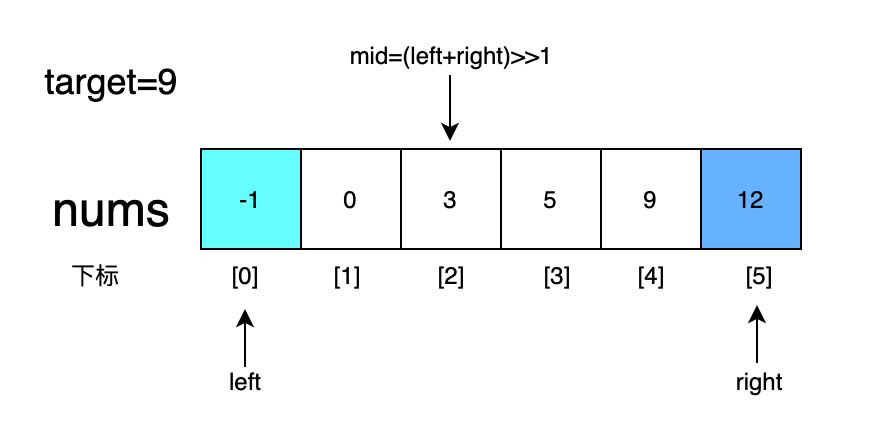
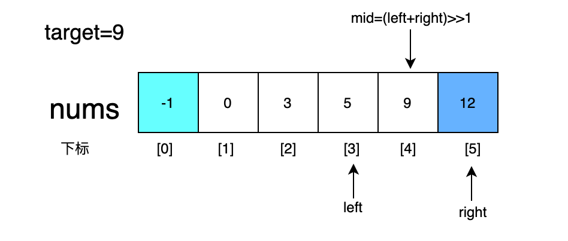
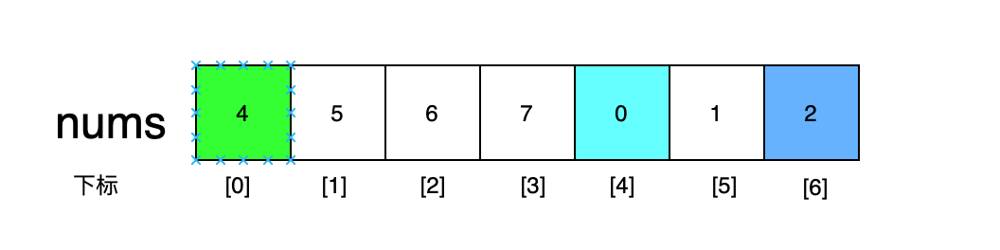
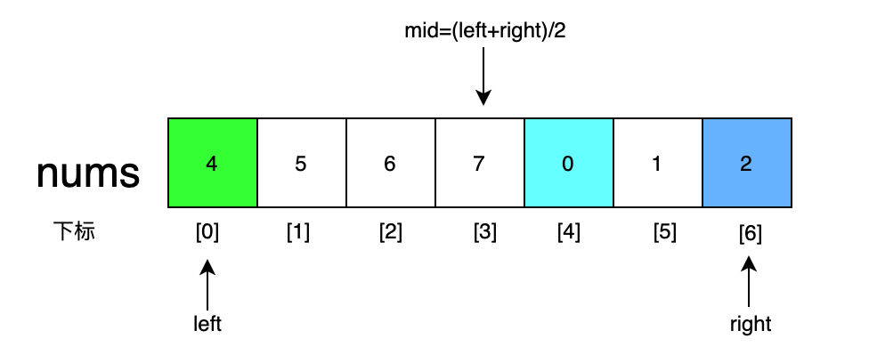

### 一、什么是二分法

#### 前言

很多同学在学算法的时候，往往只关注到了算法的应用场景，以及写法，而忘记了算法本身的定义，这对我们真正理解这个算法是十分不利的，可能稍微题目变形一下就不会了，只有抓住定义才能灵活应对题目和场景的各种变化。虽然二分法是一个比较基础的算法，很多同学可能都会，但是二分法写的过程中真的很容易出错，也是很多算法的基础，据说能一次写对二分法的程序员只有10%！还是建议大家好好看看。

#### 定义

我在维基百科上搜到的二分法**定义**如下：在计算机科学中，二分查找算法也称折半搜索算法，对数搜索算法，是一种在**有序数组**中查找**某一特定元素**的搜索算法。索过程从数组的中间元素开始，如果中间元素正好是要查找的元素，则搜索过程结束；如果某一特定元素大于或者小于中间元素，则在数组大于或小于中间元素的那一半中查找，而且跟开始一样从中间元素开始比较。如果在某一步骤数组为空，则代表找不到。这种搜索算法每一次比较都使搜索范围缩小一半。

第一句话我们抓住俩个关键词，一个是有序数组（这里可能是整体有序比如[1,2,3,4,5]，也有可能是整体有序比如[4,5,1,2,3]），一个是特定元素（也有可能是满足特定的条件），由定义我们大概就知道了二分法的应用场景，以后遇到在有序数组中找特定值都可以考虑用二分法。

第二句话比较长说的是二分法的具体使用：搜索过程从数组的中间元素开始，如果中间元素正好是要查找的元素，则搜索过程结束；如果某一特定元素大于或者小于中间元素，则在数组大于或小于中间元素的那一半中查找，而且跟开始一样从中间元素开始比较。如果在某一步骤数组为空，则代表找不到。这种搜索算法每一次比较都使搜索范围缩小一半。这句话比较长也比较绕，但其实也就是几个if语句，下面用题目的方式帮助大家进一步了解使用方法。

#### 问题

给定一个 `n` 个元素有序的（升序）整型数组 `nums` 和一个目标值 `target` ，写一个函数搜索 `nums` 中的 `target`，如果目标值存在返回下标，否则返回 `-1`。

##### 示例 :

```
输入: nums = [-1,0,3,5,9,12], target = 9
输出: 4
解释: 9 出现在 nums 中并且下标为 4
```

##### 分析：

/*这是二分非常经典的一道题目了，没学过二分的同学第一反应可能就是线性查找，即从-1一直遍历到12去查找9的下标，那么时间复杂度是O(n)，如果二分法去折半区间查找的话时间复杂度只要O(logn)！首先我们找出二分搜素法的俩个关键条件，一个是区间的边界值，一个是所要满足条件，条件这里很简单就是nums[i]==target，下面重点说一下怎样更迭区间

仔细观察一下这是一个有序数组，那么我们是不是可以用过中间那个数来和nums[left]和nums[right]做比较，以此来判断target是在mid左边的区间还是在mid右边的那个区间，不断的通过left和right俩个边界值来更新区间*/

这是二分非常经典的一道题目了，没学过二分的同学第一反应可能就是线性查找，即从-1一直遍历到12去查找9的下标，那么时间复杂度是O(n)，下面我们用二分法尝试一下

第一步我们看一下是否满足二分法的使用条件，**有序数组与查找特定元素**，题目中nums有序，查找的是指定元素target，满足条件

第二步找到nums中间的元素与target比较，这里我们设left为数组最左边的下标，right为数组最右边的下标，mid是中间值的下标



nums[mid]<target，因此target是在mid的右边区域，所以我们继续在mid右半边区域查找，我们令left=mid+1nums[mid]==target，俩次就找到了这个数，时间复杂度为O(logn)，是不是很简单

下面看一下代码

```go
func search(nums []int, target int) int {
	left := 0
	right := len(nums) - 1	
	for left <= right {	//注意
		mid := left + (right-left)>>1
		if nums[mid] > target {	
			right = mid - 1	//注意
		} else if nums[mid] < target {
			left = mid + 1
		} else if nums[mid] == target {
			return mid
		}
	}
	return -1
}
```

外层的for循环以及left和right的变动是帮助我们不断的缩小范围，当满足条件nums[mid] == target时就可以退出循环了，代码看似不难但是在循环条件和边界值的变化中真的很容易出错！

我们主要关注三个点：

1. 首先判断这题能不能用二分法解决
2. 想好target条件（二分法的变化往往就在这）
3. 然后写好if条件不要用eles每个都将条件写全，然后去判断边界值的变化

上面的代码大家也可以当作模板记下来，这样写的时候就不容易出错，下面将会介绍整数域二分，带精度的二分，边界值二分三种常见的二分法变式。

### 二、整数域二分

#### 前言

整数域二分就是指，给定的数组和要满足的条件都是整数范围内的，比如上面的例子就是整数域二分，下面再举一个例子帮助大家巩固理解

#### 问题

实现 `int sqrt(int x)` 函数。

计算并返回 *x* 的平方根，其中 *x* 是非负整数。

由于返回类型是整数，结果只保留整数的部分，小数部分将被舍去。

##### 示例 1:

```
输入: 4
输出: 2
```

**示例 2:**

```
输入: 8
输出: 2
说明: 8 的平方根是 2.82842..., 
     由于返回类型是整数，小数部分将被舍去。
```

#### 分析：

我们先看目标数要满足的条件为target * target = x 或者 mid * mid < x && (mid+1) * (mid+1)  > x，查找target的范围为0-x，那么是不是相当于在有序数组[0,1,2...x]中寻找满足条件的target，那我们不是又可以用二分了嘛！

下面看一下代码

```go
func mySqrt(x int) int {
	left := 0
	right := x
	for left <= right {
		mid := (left + right) / 2
		if (mid*mid < x && (mid+1)*(mid+1) > x) || mid*mid == x {
			return mid
		} else if mid*mid < x {
			left = mid + 1
		} else if mid*mid > x {
			right = mid - 1
		}
	}
	return 0

```
**写代码时先想好target条件和每个if中边界值的变化，再加上记住的模板就可以万无一失了**

###  三、带精度的二分

#### 前言

带精度的二分比整数域二分要复杂一点，整数域数都是整数，带精度的往往是给定一个精度范围，让你在精度范围中去寻找那个数，其实本质是一样的

#### 问题

实现 float64 sqrt(float64 x) 函数。

计算并返回 *x* 的平方根，其中 *x* 是非负浮点数。

返回精度为0.01的开方值

##### 示例 1:

```
输入: 2
输出: 1.41
```

**示例 2:**

```
输入: 8
输出: 2.82
```

#### 分析：

这题和第一题的区别就是多了一个精度，其他条件都是一样的，如果x是2的话，我们是不是可以理解为从0.00，0.01，0.02...1.18，1.19，2中去寻找到那个target，是不是和第一题越来越像了，有序区间有了！下面看需要满足的条件是什么，仔细想一下是不是当俩个区间的边界值小于0.01时就可以跳出循环了，因为这时候取值就是在精度以下了，其实和第一题一样，只不过第一题的精度是1

```go
func f(n float64) float64 {
	var left float64 = 0
	var right float64 = n
	for right-left >= 0.01 {	//注意
		mid := (left + right) / 2
		if mid*mid < n {
			left = mid + 0.1
		} else if mid*mid == n {
			return mid
		} else if mid*mid > n {
			right = mid - 0.1
		}
	}
	temp := int(left - 0.1 * 100)//注意left多加了一次要剪掉
	left = float64(temp) / 100
	return left
}
```

就是for循环的条件改一下，最后再做一下简单的精度处理，说白了还是第一题的模板，回归一下定义是不是还是那三步，先确定是不是二分，再确定target，最后确定区间边界值

### 四、边界值二分

#### 前言

前面都是target条件的变化，那么从定义出发可以变的就还有什么？还有一个数组可以玩点花了，这类题目一般是旋转数组变成局部有序，或者是数组中有重复数字，比如[]int{1,1,2,3,4,4}，求目标数字4出现的第一个位置，这种比较简单，读者可以自己尝试一下解法，下面重点说一下第一种情况。

#### 问题

假设按照升序排序的数组在预先未知的某个点上进行了旋转。例如，数组 [0,1,2,4,5,6,7] 可能变为 [4,5,6,7,0,1,2] 。

请找出其中最小的元素。

**示例 1：**

```
输入：nums = [3,4,5,1,2]
输出：1
```

**示例 2：**

```
输入：nums = [4,5,6,7,0,1,2]
输出：0
```

#### 分析

这题很经典，前面数组都是整体有序，现在变成局部有序了，老规矩先看二分的俩个条件有序和target是不是都满足了，那么这个target是不是唯一一个满足小于后一个数的，即nums[4]<nums[3]

找到了target的条件，我们再确定边界值怎样划分，先看一下这个数组的特点是什么，如果以旋转点为界分为左右俩个区间的话，4是不是左边区间的最小值，2是不是右边区间的最大值，那么根据这俩个条件是不是就可以确定求出来的nums[mid]是属于哪个区间，然后进一步缩小条件，最后得到target所在的区间

代码如下

```go
func findMin(nums []int) int {
	left := 0
	right := len(nums) - 1
	if nums[left] < nums[right] {//注意
		return nums[left]
	} else if right == 0 {
		return nums[left]
	}
	for left <= right {
		mid := (left + right) >> 1
		if nums[mid] > nums[mid+1] {
			return nums[mid+1]
		} else if nums[mid] < nums[mid-1] {
			return nums[mid]
		} else if nums[mid] < nums[left] {
			right = mid - 1
		} else if nums[mid] > nums[right] {
			left = mid + 1
		}
	}
	return nums[left]
}
```
注意这里有一个特殊情况哦，那就是数组没有经过旋转这时候就是整体有序，比如[1,2,3,4,5]就是一个未经旋转的数组，直接返回第一个元素就行了，所以我们算法在设计的时候一定要考虑到特殊情况，因为本文主要介绍二分法的使用，所以这块就略写了。

### 五、拓展

我一直认为真正弄懂了一个算法时，是能够把算法融入与生活去解决一些实际问题的，比如做实验把人分成俩组，还有下面这道题都是用二分法去解决日常生活的问题，大家可以看一下

先看一道很有意思的趣味题：
有N件产品，他们的重量都是G，但是当中有一件是不合格的产品，他的重量是g，那么现在给你一个称，求你称最少的次数找出这个产品，相信很多人小时候都遇到过这个题吧，学完了二分法之后，你会怎么解呢？

### 六、总结

1. 总的二分法分为三步，先确定是不是满足二分条件，再确定target条件，再确定边界值
2. 还有一个应该是所有题写完都应该注意的地方，写完了应该还要考虑特殊情况的考虑，这个应该是写代码之前就考虑的，但是我比较习惯写完了再加上，希望大家不要和我一样
3. 虽然二分法很简单，但是真的很容易出错，所以希望大家在写每一个条件时都尽量把条件写全，这样不容易出错
4. 最后编个口诀帮助大家记忆吧，俩个边界在左右，一个目标在中间，for中mid不断变（俩个眼睛在左右，一个鼻子在中间，吃饭时嘴巴不断嚼）


