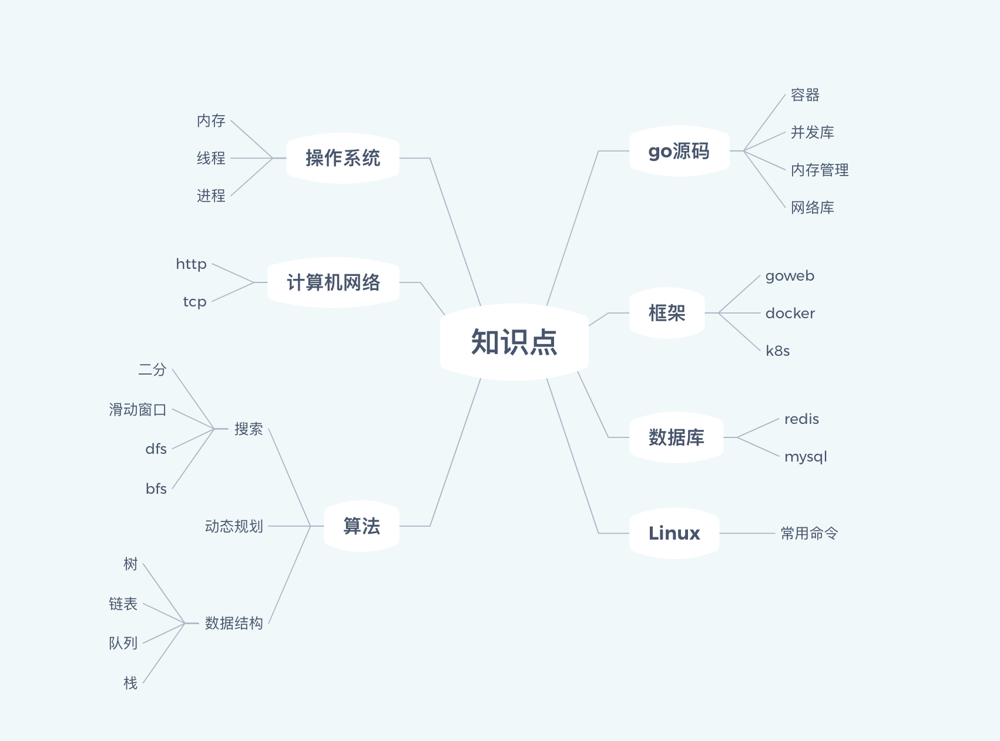
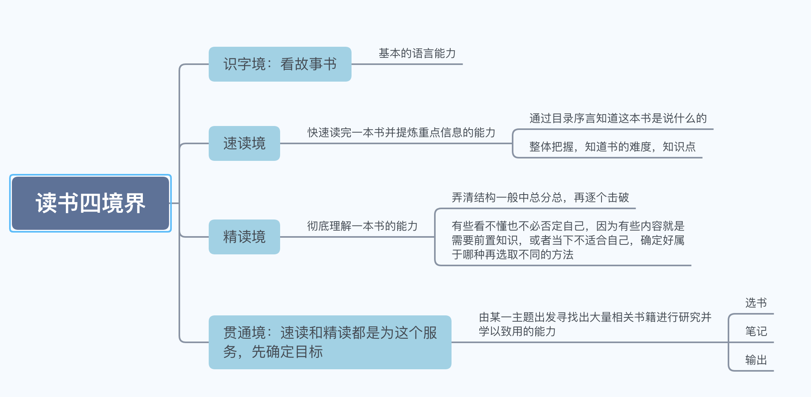
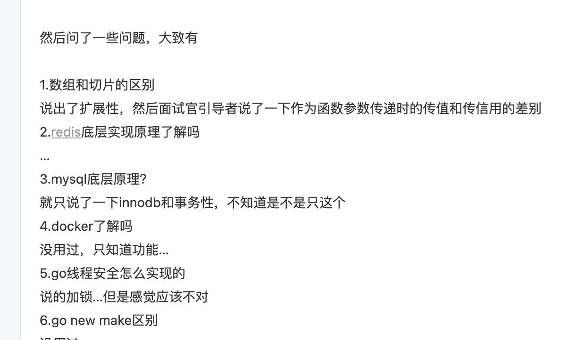
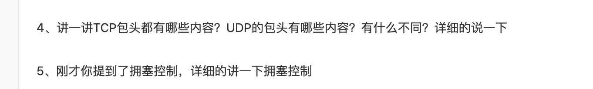
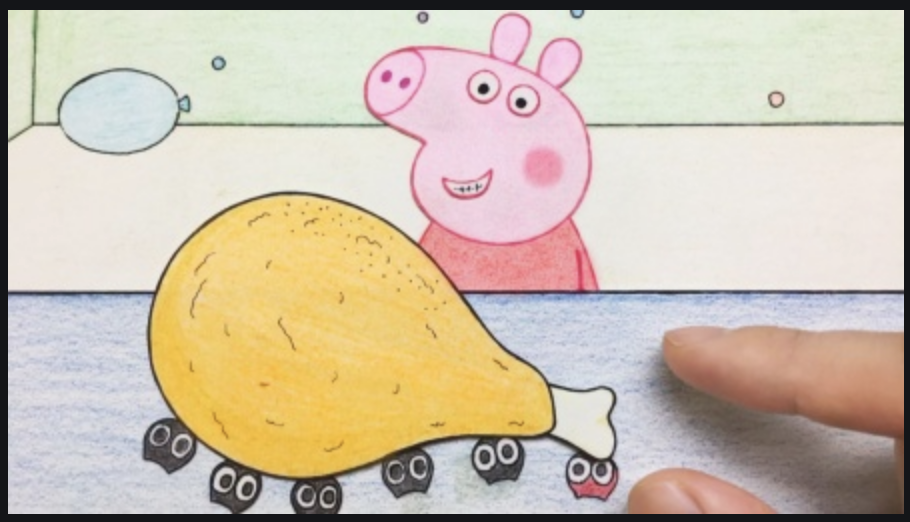

##### 一、遇见我会有什么故事？

会帮你找个好看的小姐姐，比如这样？

大熊第，那是不可能的（可以私聊试试☺️）。

言归正传，在这里可以帮你解答map，slice等容器，sync，runtime等golang标准库底层是如何实现的，算法，数据库，Linux等面试必备考点这里都会涉及，不会让你发出“这说的是啥？”的感慨。解答你“学习golang在面试时会问什么？”“面经这么容易，到我面试为什么就不会了？”“面试官为什么要问这些？”的疑问。同时读我的文章还有机会给自己加鸡腿🍗！在成为互联网优秀建设者的道路上，干饭可以加个鸡腿，offer拿到手软。

##### 二、缘起

相信作为互联网优秀建设者的每位读者，也和我一样每天都需要搜索大量的技术文章，去解决形形色色的问题，看完一篇一篇又一篇水文后，最终丢下了“这都是个啥？”的感慨。直到某个月黑风高的夜晚，我看到了憨憨龙的文章（据说他的微信头像就是他）

我惊讶的发现公众号文章质量居然这么高，此后我每周都会给憨憨龙投稿，因此我们也成为了好朋友。每次给憨憨龙投稿，憨憨龙都会给我提出很多很棒的建议。因此一篇文章修改的时间往往比写作时间更长，这也让我知道了一篇好文章的来之不易，心里面往往也会吐槽憨憨龙需要改这么多吗！但是在看到读者一个个赞，一个个在看，一句句认可之后，我发现那句帮助“别人的同时，自己也会快乐。“是真的！于是在憨憨龙的建议下，我希望可以通过我自己和大家建立彩色的纽带。

##### 三、缘续

1. 技术文章看了半天不知道在说啥？

   不知道在说啥，往往是俩个原因。一个是文章的原因，很多技术文章其实作者在写的时候，只是当作一个随笔，并没有设计好文章的结构脉络，也没有任何便于理解的配图。亦或者是作者写作水平不是很高，因为“优秀”互联网建设者往往都喜欢“show me the code”，一到写文章就犯难了。第二个则是读者自身原因了，没有良好的阅读能力，其实阅读无非就是理解作者的思想，读一篇文章时如果只是想知道文章的某个点，那么直奔那个点去阅读就可以了，如果是想吸取全文的话，那么是需要理解先弄清文章再去阅读的，这样才不容易犯困，犯难。

   

   小编将会用面试题的方式带领大家层层深入每一个知识点，将知识点之间的区别与联系剖析给各位读者。通过提问的方式，文章结构也更加清晰，帮助你快速理解知识点。

2. 面经轻描淡写，面试却是层层深入？

   相信每一个经历过秋招的小伙伴肯定都看过大量的面经，不知道各位小伙伴有没有发现面经一般都是比较简单的问题，但是在面试时才发现面经只是某个知识一开始的问题，下面会一直问到你哭为止！最终面试也就向着不可预知的方向发展了，这里小编也是以同样的方式，从最简单的问题开始，层层递进，面试时就不会犯难了😀

   

3. 面试官为什么问这个问题，是不是有病？

   秋招时小编也有同样的疑惑，所谓“面试造火箭，工作拧螺丝。“。但是工作后才发现，面试官的问题往往都是工作时会经常会遇到的问题，需要你对这个知识点有深入到底层的认知，才能解决工作中各式各样的问题。同时对一个知识的深入了解才能更好的打通知识点间的联系，就像你是背下1+1=2，那你是算不出来2+2=？的，但是如果你会用你的小指头去算，那么2+2就迎刃而解了。

   

4. 能让你加鸡腿的公众号！

   是的，你没有看错，虽然咱不能给每位读者都介绍小姐姐，但是加个小鸡腿还是可以的。为了给各位读者带来更棒的文章，所以我决定每位能给小编提出优秀建议，无论是文章内容有误，或者配图上的建议，或是有什么更棒的想法，只要被小编认可，小编都会奖励🧧5元，中午干饭的时候就可以加个鸡腿啦。

   

##### 四、最后

小编会保持每周至少一篇的进度给大家更新新鲜的文章，希望每一位读者都可以在「Golang面试宝典」中获取到自己想要的东西，我也很开心能和大家一起学习，一起讨论技术，一起进步。也欢迎大家加我微信（不然你怎么让我加鸡腿😤），希望和大家的彩色纽带能够永存！

