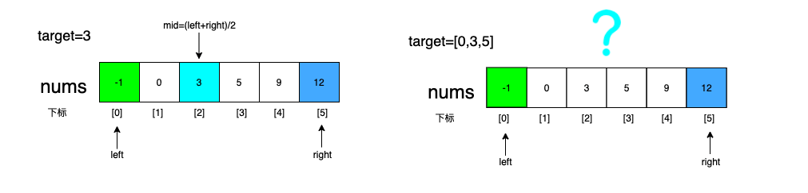
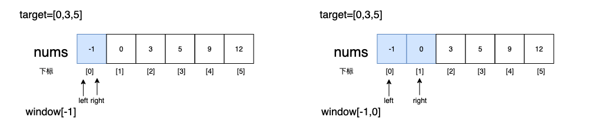
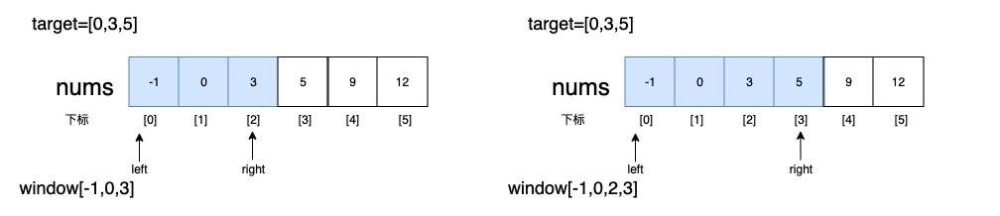
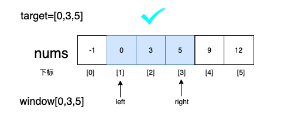
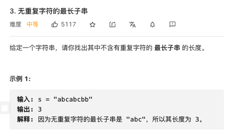

### 一、前言

1. 在数组中查找一个数，可以使用二分法查找，但是算法问题中还有一些是在数组中查找一个区间，这时滑动窗口就是一种很好的解决思路。

   

2. 认识滑动窗口题型之后，仍然有很多细节问题会在解答时出错，本文将依次介绍该算法的模板，易错点，分类题型，看完之后能极大的提高做题速度以及准确度。

### 二、什么是滑动窗口

1. 概念：滑动窗口是双指针算法的一种，利用**俩个指针**在数组上向**单一方向**滑动，形成一个子区间，根据题目要求对子区间进行剪枝，最终得出**满足条件**的区间。

2. 过程如下：

   windows中元素未完全包含target时，right向右滑动

   

   

   此时window包含target中所有元素，将left向右滑动

   

3. 代码模板

   ```go
   func checkInclusion(nums []int, target []int) bool {
     windows := make(map[byte]int, len(nums))
   	left, right := 0, 0
     
   	for right < len(nums) {
   		c := nums[right]
   		windows[c]++
   		//right右滑变量变化
   		right++
       
   		for 满足left右滑条件 {
   			//判断区间是否满足条件（可能在left右滑的前中后）
         
   			d := nums[left]
   			//left右滑变量的改动
         
   			left++
   		}
   	}
   	return false
   }
   ```

   易错点：

   - left和right滑动时，容易漏掉某个变量的值变化，这里教大家一个技巧，每次写完复查前面声明的变量，在这步是否改变
   - left右滑动时，先判断是否满足条件，再做变量值的变化

### 三、值匹配



分析：先上模板

```go
func lengthOfLongestSubstring(s string) int {
	lens := len(s)
	window := make(map[byte]int, lens)
  left, right := 0, 0
  
	for right < lens{
		c := nums[right]
		windows[c]++
		//right右滑变量变化
		right++
    
		for 满足left右滑条件 {
			//判断区间是否满足条件（可能在left右滑的前中后）
      
			d := nums[left]
			//left右滑变量的改动
      
			left++
		}
	}
	return false
}
```

1. 满足left右滑动的条件：无重复字符，即右滑时导致window容器中某个元素值不为1
2. 判断区间是否满足条件：在window中无重复的元素后，即for循环之后，判断res-left与之前无重复字符串最大长度（res）之间关系
3. right右滑动变量变化：**参照声明的四个变量**，这题只有winows和right变化
4. left右滑动变量变化：**参照声明的四个变量**，这题只有winows和left变化

```go
func lengthOfLongestSubstring(s string) int {
	lens := len(s)
	window := make(map[byte]int, lens)
	left, right, res := 0, 0, 0
  
  //right右滑动
	for right < lens {
		b := s[right]
		window[b]++
		right++
    //left右滑动
		for window[b] > 1 {
			c := s[left]
			window[c]--
			left++
		}
    //判断区间是否满足条件
		if right-left > res {
			res = right - left
		}
	}
	return res
}
```


### 四、区间匹配


分析：

1. 满足left右滑动的条件：这题和前言中题类似，设一个target切片记录目标区间每个元素的个数[A:1,B:1,C:1]，当windows中所有目标元素个数（vaild）都达到target要求时，left右滑缩小区间
2. 判断区间是否满足条件：在left右滑时，即for循环中判断当前right-left与之前最小覆盖子串之间关系
3. right右滑动变量变化：**参照声明的变量**有当前区间window，达标元素个数vaild，right
4. left右滑动变量变化：**参照声明的变量**有起始位置start，结果字符串长度res，达标元素个数vaild，当前区间window，left

```go
func minWindow(s string, t string) string {
  //变量初始化
	lens := len(s)
	lent := len(t)
	window := make(map[byte]int, lens)
	target := make(map[byte]int, lent)
	left, right, vaild := 0, 0, 0
	res := lens
	start := -1

	for i := 0; i < lent; i++ {
		target[t[i]]++
	}

  //right右滑动
	for right < lens {
		b := s[right]
		window[b]++
		if target[b] == window[b] {
			vaild++
		}
		right++
    
    //left右滑动
		for vaild == len(target) {
			c := s[left]
      //是否更新结果值
			if res >= right-left {
				start = left
				res = right - left
			}
            
			if window[c] == target[c] {
				vaild--
			}
      window[c]--
			left++
		}
	}
	if start == -1 {
		return ""
	}
	return s[start : start+res]
}
```
### 五、总结

1. 出题点：缩小区间的条件，满足条件更新结果值的位置
2. 记住模板：一容（window），二变（left，right），三扩（right右移），四缩（left右移）
3. 思路：俩个条件，俩个变化
4. 易错点：例如第二题每次滑动需要更新的变量很多，稍有不慎就会少更新某个变量，每次对照开始声明的变量可以万无一失

