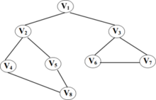
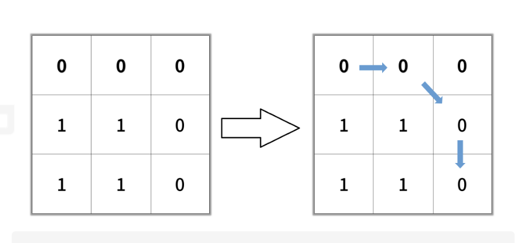
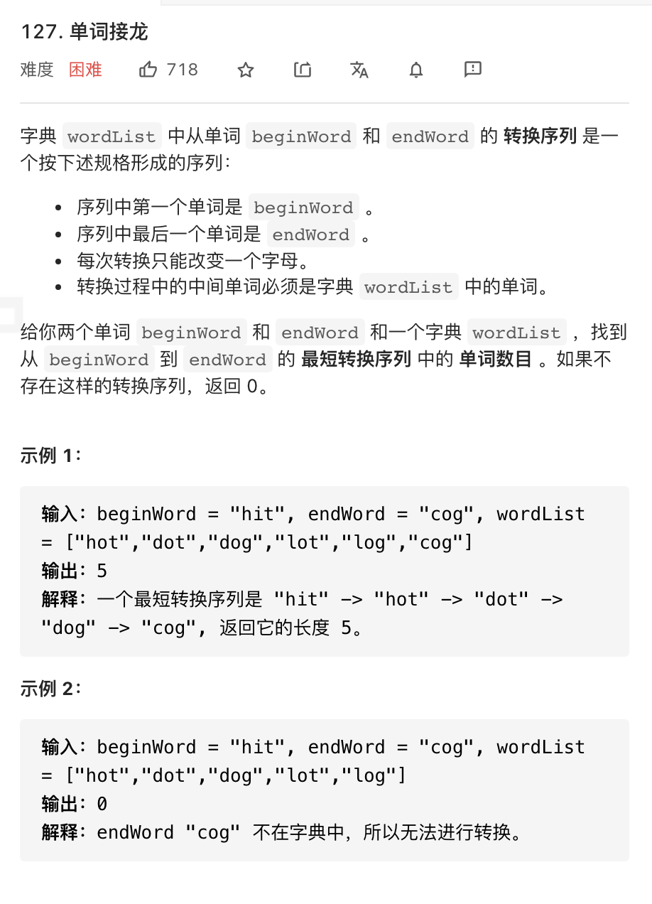
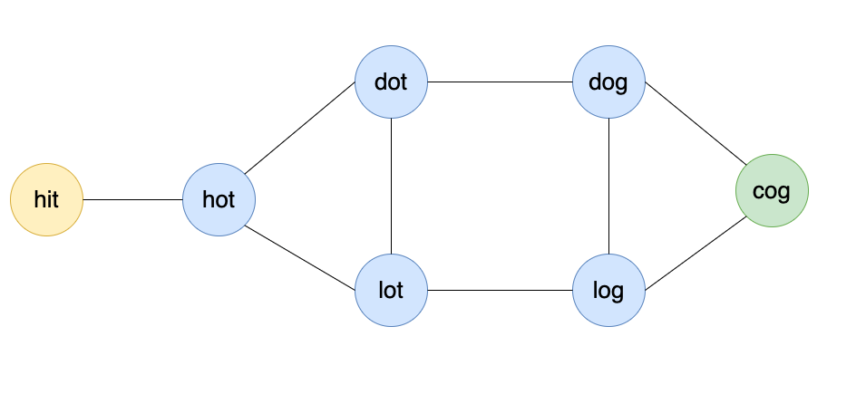

# 广度优先搜索
#### 一、前言

先看这样一个小故事，有一天，婷婷去超超的大学，想给异地已久的超超一个惊喜。但是方向感不好的婷婷很快就在大学迷路了。超超得知后便去寻找思恋已久的婷婷。此时超超的妈妈也在来学校的路上，现在超超要以最快的速度去寻找婷婷（不然可能会出现我和你妈同时迷路你先救谁的问题了🌝）。那么，问题来了，你可以制定一种策略帮超超尽快找到婷婷吗？


下面将依次介绍广度优先搜索的定义，算法模板，俩种常见的题型，以及常见的出题点于易错点，帮助超超解决问题的同时，再顺手拿个offer！

#### 二、什么是广搜

1. 广搜定义：又译作宽度优先搜索，或横向优先搜索，是一种图形搜索方法。简单的说，BFS是从根节点开始，沿着树的宽度遍历树的节点。如果所有节点均被访问，则算法终止。

   显然广度优先遍历就是树的层次遍历。

2. 广搜步骤：

   

   

   

   

   

   - 定一个出发点：假设我们从v1出发来遍历这个图，先将v1存到队列que中
   - 按层遍历：从队列中取出v1，然后将v1能搜索到的v2，v3存到队列que里面，这样第一层遍历结束，再从que中取出v2，v3进行相同操作，这样递推下去依次把所有的节点遍历完

3. 代码如下：

   ```go
   //树的节点
   type TreeNode struct {
   	Val   int
   	Left  *TreeNode
   	Right *TreeNode
   }
   
   func bfs(root *TreeNode) {
     //初始化队列
   	que := make([]*TreeNode, 0, 100)
   	que = append(que, root)
     
     //循环队列所有元素
   	for len(que) != 0 {
   		curSize := len(que)
       
       //循环遍历每层节点
   		for i := 0; i < curSize; i++ {
         
         //取出队列中节点
   			tnode := que[0]
   			que = que[1:]
         
         //遍历该节点所能到达的节点，入队列
   			if tnode.Left == nil && tnode.Right == nil {
   				continue
   			}
   			if tnode.Left != nil {
   				que = append(que, tnode.Left)
   			}
   			if tnode.Right != nil {
   				que = append(que, tnode.Right)
   			}
   		}
   	}
   }
   ```

   抽象为模板如下

   ```go
   func bfs(root *TreeNode) int {
      //初始化队列
      que := make([]*TreeNode, 0, 100)
      que = append(que, root)
      dep := 1
     
      //循环队列所有节点
      for len(que) != 0 {
         curSize := len(que)
        
         //循环遍历每层节点
         for i := 0; i < curSize; i++ {
   
            //取出队列节点
            tnode := que[0]
            que = que[1:]
           
           for 当前节点所有方向{
             //对移动后的节点做坐标值变化
             
            //特殊值，是否为边界，障碍物
             ...
            //结果值判断，是否到达题目要求的目标点
             ...
            //入队列
             ...
           }
         }
        //深度变化（步数）
         dep++
      }
      return 0
   }
   ```

   易错点：

   1. 遍历每层节点时，先求出当前队列长度curSize而不是用len(que)作为该层队列的长度，如果用len(que)后面入队列操作，会使len(que)一直在变化
   2. 边界值，结果值判断，入队列的判断顺序，因为入队列条件和边界值，结果值条件存在重合

#### 三、常见题型

##### 3.1 图中最短路径

下面来看看广搜怎么解决超超的问题，用0表示空地，1表示障碍物，假设超超在地图左上角，婷婷在地图的右下角，超超每一步可以沿着八个方向移动，那么地图可以抽象为下图所示，超超希望的也就是用最少的移动步数从左上角移动到右下角：



分析：看到图中求最短路径问题，明显属于广度优先求解的一种题型，下面上模板

```go
func bfs(root *TreeNode) int {
   //初始化队列
   que := make([]*TreeNode, 0, 100)
   que = append(que, root)
   dep := 1
  
   //循环队列所有节点
   for len(que) != 0 {
      curSize := len(que)
     
      //循环遍历每层节点
      for i := 0; i < curSize; i++ {

         //取出队列节点
         tnode := que[0]
         que = que[1:]
        
        for 当前节点所有方向{
          //对移动后的节点做坐标值变化
          
         //特殊值，是否为边界，障碍物
          ...
         //结果值判断，是否到达题目要求的目标点
          ...
         //入队列
          ...
        }
      }
     //深度变化（步数）
      dep++
   }
   return 0
}
```

1. 是否需要visit标识：在搜索时每个节点都会向八个方向搜索，A向右移动到B节点入队列后，向后遍历下一层时B还会向左搜索到A，因此需要用visit进行标识该节点是否被遍历过
2. 确定移动方向：超超一共有八个移动方向，可以用数组next := [][]int{{1, 0}, {-1, 0}, {0, 1}, {0, -1}, {1, 1}, {1, -1}, {-1, 1}, {-1, -1}}表示移动方向，俩个维度分别表示坐标x和y的变化
3. 遍历的特殊值判断：这题有边界值墙，障碍物，以及终点

完整代码如下：

```go
func shortestPathBinaryMatrix(grid [][]int) int {
	width := len(grid)
  //若起点和终点是障碍物则地图有问题
	if grid[0][0] == 1 || grid[width-1][width-1] == 1 {
		return -1
	}
  //地图中起点和终点是一个点
	if width == 1 {
		return 1
	}
  
  //初始化队列和visit
	que := make([]*Node, 0, width*width)
	visit := make([][]bool, width)
	for i := 0; i < len(visit); i++ {
		visit[i] = make([]bool, width)
	}
	dep := 1
  //每个节点所能走的八个方向
	next := [][]int{{1, 0}, {-1, 0}, {0, 1}, {0, -1}, {1, 1}, {1, -1}, {-1, 1}, {-1, -1}}
	que = append(que, &Node{0, 0})
	visit[0][0] = true
  
  //开始搜索
	for len(que) != 0 {
		current := len(que)
    //按层遍历
		for i := 0; i < current; i++ {
			top := que[0]
			que = que[1:]
      //对队列中的节点做八个方向的坐标变化
			for i := 0; i < 8; i++ {
				var temp *Node = new(Node)
				temp.x = top.x + next[i][0]
				temp.y = top.y + next[i][1]
        //移动后坐标越界
				if temp.x >= width || temp.x < 0 || temp.y >= width || temp.y < 0 {
					continue
				}
        //找到终点（右下角）
				if temp.x == width-1 && temp.y == width-1 {
					return dep + 1
				}
        //不是障碍物并且没有被遍历过入队列
				if grid[temp.x][temp.y] != 1 && !visit[temp.x][temp.y] {
					que = append(que, temp)
					visit[temp.x][temp.y] = true
				}
			}
		}
    //层数加1
		dep++
	}
	return -1
}
```

##### 3.2 字符串最短变化次数



分析：帮助完超超之后，也要为我们的offer好好准备下了，面试算法很少会直接出一个图的bfs题型，比较常见的是这种题型。这题看似和bfs没有关系，起点hit能匹配的字符串为*it，h * t，hi*，与worldList中可以匹配的节点就可以连接了，这样依次连接下去是不是就可以练成图了！这题也就变成了求hit到cog的最短距离。



分析：

1. 是否需要visit标识：这题的visit有俩个含义，一个是判断当前map中是否有匹配的word，二是做备忘录，当从hit出发将hot加入队列后，防止hot遍历其可到达的点时又将hit加入队列中
2. 确定移动方向：以hit为例，只要满足*it，h * t，hi*，都为可移动方向，也就是循环hit中每一个字符，从'a'到'z'遍历，根据visit判断字典中是否有该字符串
3. 遍历的特殊值判断：终点，是否被遍历过

代码：

```go
func ladderLength(beginWord string, endWord string, wordList []string) int {
	//定义并初始化visit
	visit := map[string]bool{}
	for _, w := range wordList {
		visit[w] = false
	}
	que := []string{beginWord}
	dep := 1
  //遍历所有元素
	for len(que) != 0 {
		curSize := len(que)
		for i := 0; i < curSize; i++ {
			top := que[0]
			que = que[1:]
			if top == endWord {
				return dep
			}
      //判断能连接的字符串
			for c := 0; c < len(top); c++ {
				for j := 'a'; j <= 'z'; j++ {
					newWord := top[:c] + string(j) + top[c+1:]
					if visit[newWord] == false {
						que = append(que, newWord)
						visit[newWord] = true
					}
				}
			}
		}
		dep++
	}
	return 0
}
```

 #### 四、总结
1. 出题点：题型一共是三种，树的层次遍历，图的最短路径，字符串匹配最短路径，找准关键字“最短路径”，“层次遍历”

2. 模板记忆：水纹波动有规律，层次遍历层层清（cursize，visit），找准特殊位置点（墙，终点，是否便利过），判断条件定先后（特殊点判断先后顺序）

   

3. 思路：拿到题目，我们首先可以捕捉关键词，一旦看到有“最短路径”、“层次遍历”这种词语，那么我们应该第一反应想到BFS。但是有时候题目会隐藏这种暴露语句，例如单词接龙一样，这时我们需要抽象它的本质。确定了方案之后，我们就可以直接套模板了。但是，需要注意的是，在遍历时或许会有重复路径的可能，这时不要忘了设visted的备忘录。同时，我们需要注意障碍物，边界值，终点位置的先后判断

4. 易错点：循环队列中节点用curSize记录当前队列长度，而不是用len(que)


